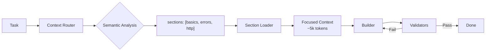

# Claude Code Hooks Mastery

> **Fork Notice:** This is a personal fork of [disler/claude-code-hooks-mastery](https://github.com/disler/claude-code-hooks-mastery) tailored for **Java** and **Java + React** projects.

## What's Different in This Fork

### Validators (PostToolUse hooks)

| Stack | Tools |
|-------|-------|
| **Java** | Spotless (Palantir), Maven compile, JaCoCo 80%, PMD, OSS Index |
| **React/TS** | ESLint, TypeScript compiler, Prettier |
| **Python** | Ruff, Ty, Bandit |

### References (`.claude/refs/`)

| File | Content |
|------|---------|
| `java-patterns.md` | Java 17/21 coding standards, Spring Boot patterns |
| `java-testing.md` | Testcontainers, Podman, Allure, Selenide E2E, JaCoCo |

### Agents (`.claude/agents/team/`)

| Agent | Model | Purpose |
|-------|-------|---------|
| `builder.md` | Opus | Universal builder for Java/React/Python with Context7 integration |
| `validator.md` | Opus | Read-only validation agent |
| `monitor.md` | Haiku | Lightweight sub-agent observer (use with status_line_v10 for real-time visibility) |

### Status Line with Agent Monitor (v10)

The status line provides **real-time visibility** into parallel sub-agents directly in the terminal — always visible, no extra cost.

**When idle (no agents):**
```
[Opus] # [######---------] | 42.0% used | ~116k left | abc12345
```

**When agents are running (multi-line):**
```
[Opus] [###-----] 42% | ▶2 ✓1
 ▶ builder         12s  Edit Service.java
 ▶ Explore         8s   Read App.tsx
```

**Dynamic lifecycle — updates every 300ms:**
```
Step 1: agent starts     → ▶1  builder  0s  Read App.java
Step 2: second agent     → ▶2  builder Read App.java + Explore Write Cart.tsx
Step 3: action changes   → ▶2  builder Edit Service.java (updated!)
Step 4: agent finishes   → ▶1 ✓1  only running agents shown
Step 5: all done         → back to standard single-line format
```

**How it works:**
- `status_line_v10.py` extends v6 (context window bar) with agent monitoring
- Reads `logs/subagent_start.json` + `logs/subagent_stop.json` to compute running/done agents
- Filters by current `session_id` — no phantom agents from old sessions
- For running agents, reads the last 64KB of transcript `.jsonl` to extract the current tool action
- `fcntl` file locking in hooks prevents race conditions when parallel agents write simultaneously
- Logs reset on session start — no infinite accumulation
- Filters out `monitor` and `context-router` agent types from display
- ~32ms per invocation (10x under the 300ms limit)

### Semantic Context Routing

Instead of loading all refs or creating multiple agents, this fork uses **dynamic section loading**:



**How it works:**
1. `context_router.py` analyzes task semantically
2. Returns only required section names
3. `section_loader.py` extracts marked sections from refs
4. Builder gets focused context instead of full files

### Real Example: Token Savings

**Task:** `"Add GET /api/tutors/{id} endpoint with 404 handling and integration test"`

| Approach | What's Loaded | Tokens |
|----------|---------------|--------|
| **Full refs** | java-patterns.md + java-testing.md | ~20,000 |
| **Semantic routing** | basics + errors + structure + http | ~5,847 |
| **Savings** | | **71%** |

```bash
# Router output
{
  "sections": ["java-patterns#basics", "java-patterns#errors",
               "java-testing#structure", "java-testing#integration"],
  "reasoning": "'endpoint' → basics; '404' → errors; 'test' → structure..."
}
```

### Available Sections

**java-patterns.md:**
| Section | Content |
|---------|---------|
| `basics` | No-nest, fail-fast, final, Lombok, comments |
| `errors` | @ControllerAdvice, exceptions, 404/400/409 |
| `java17` | Records, pattern matching, switch expressions |
| `java21` | Virtual threads, sequenced collections |

**java-testing.md:**
| Section | Content |
|---------|---------|
| `structure` | Naming, given-when-then, AssertJ, Allure |
| `integration` | Testcontainers, Podman, base test class |
| `http` | REST tests, MockMvc, TestRestTemplate |
| `kafka` | Kafka consumer/producer tests |
| `jdbc` | Repository tests, transactions |
| `mockito` | Unit tests, mocks, edge cases |
| `e2e` | Selenide, browser tests, page objects |
| `maven` | Surefire, Failsafe, JaCoCo config |

### Comparison with Other Approaches

| Approach | Tokens | Agents | Flexibility |
|----------|--------|--------|-------------|
| Universal (load all) | 22,500 | 1 | Low |
| Specialized (3 agents) | 7,500-15,500 | 3 | Medium |
| **Semantic routing** | **~5,000** | **1** | **High** |

**Key Differences:**

| Aspect | Default Claude | This Fork |
|--------|----------------|-----------|
| **Context loading** | Reactive exploration | Semantic pre-routing |
| **Standards** | Agent's training data | Your `.claude/refs/*.md` |
| **Granularity** | Full files | Marked sections |
| **Validation** | Manual review | Auto-validators |

## Quick Start

Run in your project directory:

```bash
curl -fsSL https://raw.githubusercontent.com/a-simeshin/claude-code-hooks-mastery/main/install.sh | bash
```

This installs `.claude/` with refs, agents, and validators. Start Claude Code to use them.

### Uninstall

```bash
curl -fsSL https://raw.githubusercontent.com/a-simeshin/claude-code-hooks-mastery/main/uninstall.sh | bash
```

## Validators Auto-Trigger by File Extension

| Extension | Validators |
|-----------|------------|
| `.java` | spotless, maven_compile |
| `.ts`, `.tsx` | eslint, tsc |
| `.js`, `.jsx` | eslint, prettier |
| `.py` | ruff, ty, bandit |

## Prerequisites

- **[Claude Code](https://docs.anthropic.com/en/docs/claude-code)** — Anthropic's CLI for Claude AI
- **[Astral UV](https://docs.astral.sh/uv/)** — Auto-installed by installer (or `brew install uv`)

## Original Documentation

- [Original repository](https://github.com/disler/claude-code-hooks-mastery) by [@disler](https://github.com/disler)
