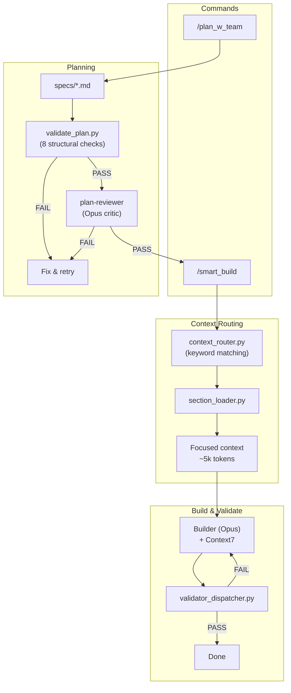

# Claude Code Hooks Mastery

> Personal fork of [disler/claude-code-hooks-mastery](https://github.com/disler/claude-code-hooks-mastery) — a multi-agent framework for **Java**, **React/TypeScript**, and **Python** projects built on Claude Code hooks.

## Quick Start

```bash
curl -fsSL https://raw.githubusercontent.com/a-simeshin/claude-code-hooks-mastery/main/install.sh | bash
```

Installs `.claude/` directory with refs, agents, hooks, and validators into the current project.

**Prerequisites:** [Claude Code](https://docs.anthropic.com/en/docs/claude-code), [Astral UV](https://docs.astral.sh/uv/) (auto-installed)

```bash
# Non-interactive install (for CI/Claude Code automation)
bash install.sh --force

# Custom options via env vars
STATUS_LINE_CHOICE=2 TTS_ENABLED=y bash install.sh --force

# Uninstall
curl -fsSL https://raw.githubusercontent.com/a-simeshin/claude-code-hooks-mastery/main/uninstall.sh | bash
```

## Architecture



## Features

This fork extends [@disler](https://github.com/disler)'s original repository.

| Feature | What it does | vs Original | Docs |
|---------|-------------|-------------|------|
| **Context Routing** | Keyword-based section routing — loads only relevant refs per task, zero LLM cost | Original loads all refs into context | [docs/context-routing.md](docs/context-routing.md) |
| **Plan With Team** | Two-round interview + Section Routing Catalog + Testing Strategy + 8-check validation | No structural validation in original | [docs/plan-w-team.md](docs/plan-w-team.md) |
| **Testing Strategy** | Enforced 80/15/5 test pyramid (unit / integration-API / UI e2e), dedicated `write-tests` task | Not in original | — |
| **Plan Review** | Two-stage gate before build: structural validator + 8-criteria Opus architect critic | Not in original | [docs/plan-review.md](docs/plan-review.md) |
| **Context7** | Mandatory live documentation lookup for any library via MCP | Not in original | — |
| **Serena** | Optional semantic code navigation via LSP — symbol search, references, type hierarchy | Not in original | — |
| **Validators** | Smart dispatcher runs matching validators per file extension (Java/React/Python) | Separate hooks per tool in original | [docs/validators.md](docs/validators.md) |
| **Status Line** | Context window progress bar (3 variants: usage bar, powerline, cost tracking) | Basic in original | [docs/status-line.md](docs/status-line.md) |
| **Install / Uninstall** | One-line `curl` install + non-interactive mode for CI/Claude Code | Manual setup in original | — |

## MCP Integrations

### [Context7](https://github.com/upstash/context7) (mandatory)

Live documentation lookup for any library. Builder and validator agents query Context7 before implementation to get current API references instead of relying on training data. Covers Spring Boot, React, FastAPI, and any other library.

### [Serena](https://github.com/oraios/serena) (optional)

Semantic code intelligence via Language Server Protocol. When available, all agents prefer Serena's symbol-level navigation (`find_symbol`, `get_symbols_overview`, `find_referencing_symbols`) over Glob/Grep for code exploration. Plan_w_team also uses Serena's `write_memory` / `read_memory` to persist architectural decisions across sessions. If Serena is not configured, agents fall back to Glob/Grep/Read.

## Commands

| Command | Description |
|---------|-------------|
| `/plan_w_team` | Create a plan with multi-agent team orchestration and testing strategy |
| `/smart_build` | Build with context routing + plan review gate |
| `/plan` | Quick single-agent implementation plan |
| `/update_status_line` | Update custom key-value pairs in session status line |
| `/all_tools` | List all available tools |

## Credits

- Original repository by [@disler](https://github.com/disler)
- Research: [ACC-Collab (ICLR 2025)](https://openreview.net/forum?id=nfKfAzkiez), [MAST (ICLR 2025)](https://arxiv.org/abs/2503.13657), [AdaptOrch (2026)](https://arxiv.org/abs/2602.16873)
