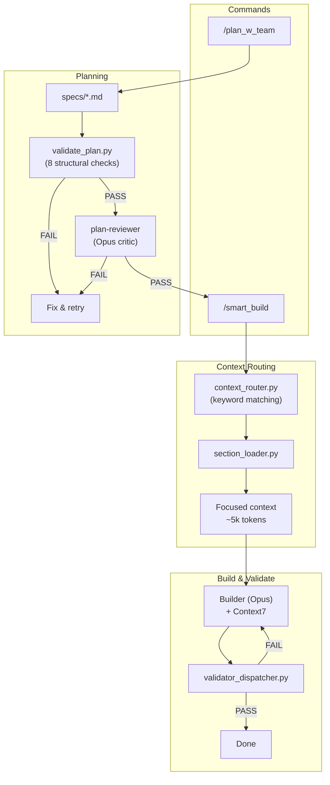

# Claude Code Hooks Mastery

> Personal fork of [disler/claude-code-hooks-mastery](https://github.com/disler/claude-code-hooks-mastery) — a multi-agent framework for **Java**, **React/TypeScript**, and **Python** projects built on Claude Code hooks.

## Quick Start

```bash
curl -fsSL https://raw.githubusercontent.com/a-simeshin/claude-code-hooks-mastery/main/install.sh | bash
```

Installs `.claude/` directory with refs, agents, hooks, and validators into the current project.

**Prerequisites:** [Claude Code](https://docs.anthropic.com/en/docs/claude-code), [Astral UV](https://docs.astral.sh/uv/) (auto-installed)

```bash
# Non-interactive install (for CI/Claude Code automation)
bash install.sh --force

# Custom options via env vars
STATUS_LINE_CHOICE=2 TTS_ENABLED=y bash install.sh --force

# Uninstall
curl -fsSL https://raw.githubusercontent.com/a-simeshin/claude-code-hooks-mastery/main/uninstall.sh | bash
```

## Architecture



## What's Different From the Original

This fork extends [@disler](https://github.com/disler)'s original with:

| Area | Original | This Fork |
|------|----------|-----------|
| **Plan Validation** | No structural checks | 8 automated checks (unique IDs, dependency DAG, agent types, Stack routing, testing task) |
| **Testing Strategy** | Not addressed | Enforced 80/15/5 test pyramid (unit / integration-API / UI e2e) with dedicated `write-tests` task |
| **Context7** | Not integrated | Mandatory live documentation lookup for any library before implementation |
| **Install** | Manual setup | One-line `curl` install + non-interactive mode for CI/Claude Code |
| **Validator Dispatch** | Separate hooks per tool | Smart dispatcher by file extension — 57% fewer subprocess calls |
| **Plan Review** | No pre-build review | Two-stage gate: structural validator + 8-criteria Opus architect critic |
| **Context Routing** | All refs loaded (~40k tokens) | Keyword-based section routing — loads ~5k focused tokens per task |
| **Status Line** | Basic | 3 variants (context bar, powerline, cost tracking) with color-coded utilization |

## Features

| Feature | Summary | Docs |
|---------|---------|------|
| **Context Routing** | Keyword-based section routing — 85% token savings, zero LLM cost, <100ms | [docs/context-routing.md](docs/context-routing.md) |
| **Plan With Team** | Two-round interview + Section Routing Catalog + Testing Strategy + 8-check validation | [docs/plan-w-team.md](docs/plan-w-team.md) |
| **Testing Strategy** | Enforced 80/15/5 test pyramid — every plan must include a dedicated testing task | — |
| **Plan Review** | Two-stage validation gate — structural check + 8-criteria Opus critic | [docs/plan-review.md](docs/plan-review.md) |
| **Context7** | Live documentation lookup for any library via MCP — always up-to-date API references | — |
| **Validators** | Smart dispatcher runs matching validators per file extension (Java/React/Python) | [docs/validators.md](docs/validators.md) |
| **Status Line** | Context window progress bar in terminal (3 variants) | [docs/status-line.md](docs/status-line.md) |

## Commands

| Command | Description |
|---------|-------------|
| `/plan_w_team` | Create a plan with multi-agent team orchestration and testing strategy |
| `/smart_build` | Build with context routing + plan review gate |
| `/plan` | Quick single-agent implementation plan |
| `/update_status_line` | Update custom key-value pairs in session status line |
| `/all_tools` | List all available tools |

## Credits

- Original repository by [@disler](https://github.com/disler)
- Research: [ACC-Collab (ICLR 2025)](https://openreview.net/forum?id=nfKfAzkiez), [MAST (ICLR 2025)](https://arxiv.org/abs/2503.13657), [AdaptOrch (2026)](https://arxiv.org/abs/2602.16873)
