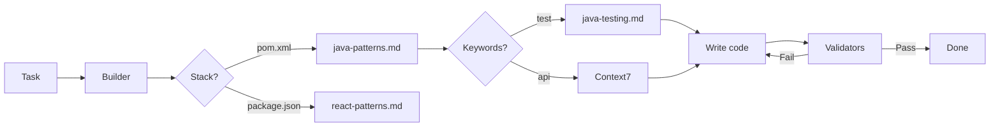

# Claude Code Hooks Mastery

> **Fork Notice:** This is a personal fork of [disler/claude-code-hooks-mastery](https://github.com/disler/claude-code-hooks-mastery) tailored for **Java** and **Java + React** projects.

## What's Different in This Fork

### Validators (PostToolUse hooks)

| Stack | Tools |
|-------|-------|
| **Java** | Spotless (Palantir), Maven compile, JaCoCo 80%, PMD, OSS Index |
| **React/TS** | ESLint, TypeScript compiler, Prettier |
| **Python** | Ruff, Ty, Bandit |

### References (`.claude/refs/`)

| File | Content |
|------|---------|
| `java-patterns.md` | Java 17/21 coding standards, Spring Boot patterns |
| `java-testing.md` | Testcontainers, Podman, Allure, Selenide E2E, JaCoCo |

### Agents (`.claude/agents/team/`)

| Agent | Purpose |
|-------|---------|
| `builder.md` | Universal builder for Java/React/Python with Context7 integration |
| `validator.md` | Read-only validation agent |

**Key feature:** References on Demand — auto-load refs based on task keywords (test, controller, api, etc.)

### Agent Specialization for Token Optimization

Universal agent loads all references into context. Specialized agents load only what's needed:

| File | Size | ~Tokens |
|------|------|---------|
| `builder.md` | 10 KB | 2,500 |
| `java-patterns.md` | 24 KB | 6,000 |
| `java-testing.md` | 56 KB | 14,000 |
| **Total** | **90 KB** | **22,500** |

**Comparison:**

| Approach | Dev Task | Test Task |
|----------|----------|-----------|
| Universal builder | 22,500 tokens | 22,500 tokens |
| Specialized java-developer | 7,500 tokens | — |
| Specialized java-tester | — | 15,500 tokens |
| **Savings** | **67%** | **31%** |

**When to specialize:**
- High volume of similar tasks → create dedicated agent
- Large reference files (>10KB) → split by domain
- Context window pressure → reduce noise

**Trade-off:** More agents to maintain vs. lower token costs and focused context.

### Default Claude Code Flow


### This Fork — References on Demand



**Key Differences:**

| Aspect | Default | This Fork |
|--------|---------|-----------|
| **Context** | Reactive exploration | Proactive refs loading |
| **Standards** | Agent's training data | Your `.claude/refs/*.md` |
| **Validation** | Manual review | Auto-validators on Write/Edit |
| **Feedback** | After task complete | Immediate block + fix |

## Quick Start

Run in your project directory:

```bash
curl -fsSL https://raw.githubusercontent.com/a-simeshin/claude-code-hooks-mastery/main/install.sh | bash
```

This installs `.claude/` with refs, agents, and validators. Start Claude Code to use them.

### Uninstall

```bash
curl -fsSL https://raw.githubusercontent.com/a-simeshin/claude-code-hooks-mastery/main/uninstall.sh | bash
```

## Validators Auto-Trigger by File Extension

| Extension | Validators |
|-----------|------------|
| `.java` | spotless, maven_compile |
| `.ts`, `.tsx` | eslint, tsc |
| `.js`, `.jsx` | eslint, prettier |
| `.py` | ruff, ty, bandit |

## Prerequisites

- **[Astral UV](https://docs.astral.sh/uv/getting-started/installation/)** — Fast Python package installer
- **[Claude Code](https://docs.anthropic.com/en/docs/claude-code)** — Anthropic's CLI for Claude AI

## Original Documentation

- [Original repository](https://github.com/disler/claude-code-hooks-mastery) by [@disler](https://github.com/disler)
- [ORIGINAL_README.md](ORIGINAL_README.md) — full documentation on hooks, sub-agents, status lines, output styles
