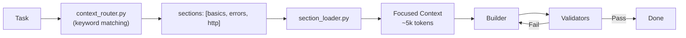
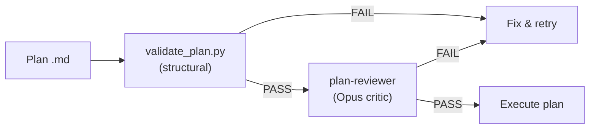

# Claude Code Hooks Mastery

> **Fork Notice:** This is a personal fork of [disler/claude-code-hooks-mastery](https://github.com/disler/claude-code-hooks-mastery) tailored for **Java**, **React/TypeScript**, and **Python** projects.

## What's Different in This Fork

### Validators (PostToolUse hooks)

| Stack | Tools |
|-------|-------|
| **Java** | Spotless (Palantir), Maven compile, JaCoCo 80%, PMD, OSS Index |
| **React/TS** | ESLint, TypeScript compiler, Prettier |
| **Python** | Ruff, Ty, Bandit |

### References (`.claude/refs/`)

| File | Sections | Content |
|------|----------|---------|
| `java-patterns.md` | `basics`, `java17`, `java21`, `errors`, `search` | Java 17/21 coding standards, Spring Boot patterns |
| `java-testing.md` | `structure`, `integration`, `http`, `kafka`, `jdbc`, `mockito`, `e2e`, `maven` | Testcontainers, Podman, Allure, Selenide E2E, JaCoCo |
| `react-patterns.md` | `core`, `nextjs`, `vite` | React 19, Next.js 15 App Router, Vite SPA with React Router v7 |
| `python-patterns.md` | `core`, `fastapi`, `testing` | Python 3.11+ typing, FastAPI + Pydantic v2, Pytest fixtures |

### Agents (`.claude/agents/team/`)

| Agent | Model | Purpose |
|-------|-------|---------|
| `builder.md` | Opus | Universal builder for Java/React/Python with Context7 integration |
| `validator.md` | Sonnet | Read-only validation agent (downgraded from Opus — 80% cost savings) |
| `monitor.md` | Haiku | Lightweight sub-agent observer (use with status_line_v10 for real-time visibility) |
| `plan-reviewer.md` | Opus | **Critic agent** — reviews plans before execution, returns structured PASS/FAIL verdict |

### Status Line with Agent Monitor (v10)

The status line provides **real-time visibility** into parallel sub-agents directly in the terminal — always visible, no extra cost.

**When idle (no agents):**
```
[Opus] # [######---------] | 42.0% used | ~116k left | abc12345
```

**When agents are running (multi-line):**
```
[Opus] [###-----] 42% | ▶2 ✓1
 ▶ builder         12s  Edit Service.java
 ▶ Explore         8s   Read App.tsx
```

**Dynamic lifecycle — updates every 300ms:**
```
Step 1: agent starts     → ▶1  builder  0s  Read App.java
Step 2: second agent     → ▶2  builder Read App.java + Explore Write Cart.tsx
Step 3: action changes   → ▶2  builder Edit Service.java (updated!)
Step 4: agent finishes   → ▶1 ✓1  only running agents shown
Step 5: all done         → back to standard single-line format
```

**How it works:**
- `status_line_v10.py` extends v6 (context window bar) with agent monitoring
- Reads `logs/subagent_start.json` + `logs/subagent_stop.json` to compute running/done agents
- Filters by current `session_id` — no phantom agents from old sessions
- For running agents, reads the last 64KB of transcript `.jsonl` to extract the current tool action
- `fcntl` file locking in hooks prevents race conditions when parallel agents write simultaneously
- Logs reset on session start — no infinite accumulation
- Filters out `monitor` and `context-router` agent types from display
- ~32ms per invocation (10x under the 300ms limit)

### Deterministic Context Routing

Instead of loading all refs, this fork uses **keyword-based section routing** — zero LLM cost, 100% reliable:



**How it works:**
1. `context_router.py` matches task keywords against a routing table (no LLM call)
2. Returns required section names with stack disambiguation
3. `section_loader.py` extracts marked sections from refs
4. Builder gets focused context instead of full files

```bash
# Example: pipe task through router → loader
echo "Создай FastAPI endpoint для пользователей" | \
  uv run --script .claude/hooks/context_router.py | \
  uv run --script .claude/hooks/section_loader.py
# → loads python-patterns#core + python-patterns#fastapi (~7k tokens)
```

**Why not LLM routing?** Haiku was tested as a semantic router (context-router agent) but scored **1/6** — hallucinated section names, ignored Python/React catalogs, generated code instead of JSON. Deterministic keyword matching: **8/8**, zero cost, <100ms.

### Plan Review — Critic Pattern (Tier 3.1)

Before executing a plan, this fork runs a **two-stage validation gate** — structural checks + architect-level content review. This prevents wasted compute on flawed plans.



**Stage 1 — Structural validation** (`validate_plan.py`, deterministic):
- Required sections present (Task Description, Objective, Steps, Acceptance Criteria)
- Agent types reference existing `.claude/agents/team/*.md` files
- Task dependencies form a valid DAG (no cycles, no missing refs)
- Team member roles match available agent types

**Stage 2 — Content review** (`plan-reviewer.md`, Opus):

The critic agent evaluates the plan against **8 criteria**:

| # | Criterion | What it catches |
|---|-----------|-----------------|
| 1 | Problem Alignment | Plan solves a different problem than stated |
| 2 | Completeness | Requirements with no corresponding tasks |
| 3 | Questions Gap | Critical unknowns assumed without justification |
| 4 | Risk Assessment | Dangerous operations without safeguards |
| 5 | Overengineering | 200-line framework for a 20-line problem |
| 6 | Pattern Compliance | Contradicts project patterns from `.claude/refs/` |
| 7 | Dependency Correctness | Tasks depend on things not yet built |
| 8 | Cost Appropriateness | Opus for trivial tasks, Haiku for complex reasoning |

**Verdict:** PASS / CONDITIONAL PASS / FAIL. One FAIL on any criterion = overall FAIL.

**Integration with `/smart_build`:**
```bash
/smart_build specs/my-plan.md
# Step 0: validate_plan.py → structural check
# Step 0: plan-reviewer agent → content review
# If both pass → execute plan
# If either fails → show issues, ask user
```

**Real-world catch:** When tested on `specs/hooks-update-with-team.md`, the critic detected that all 5 "new" files already existed in the codebase (up to 319 lines each with advanced features like `fcntl` file locking). Verdict: FAIL on 4/8 criteria — prevented a 14-agent deployment that would have either been a no-op or destructively overwritten working code.

**Research basis:**
- [ACC-Collab (ICLR 2025)](https://openreview.net/forum?id=nfKfAzkiez) — Actor-Critic Constrained Collaboration outperforms unconstrained multi-agent debate. The builder (actor) proposes, the critic reviews with structured constraints.
- [MAST (ICLR 2025)](https://arxiv.org/abs/2503.13657) — Multi-Agent Software Testing failure taxonomy. 53.1% of multi-agent failures stem from planning errors — validating plans before execution addresses the largest failure category.
- [AdaptOrch (Feb 2026)](https://arxiv.org/abs/2602.16873) — Adaptive orchestration shows 12-23% improvement from optimal agent topology selection, validating the cost-appropriateness criterion.

### Real Example: Token Savings

**Task:** `"Add GET /api/tutors/{id} endpoint with 404 handling and integration test"`

| Approach | What's Loaded | Tokens |
|----------|---------------|--------|
| **Full refs** | all 4 ref files | ~40,000 |
| **Keyword routing** | basics + errors + structure + http | ~5,847 |
| **Savings** | | **85%** |

```bash
# Router output
echo "Add GET /api/tutors/{id} endpoint with 404 handling" | \
  uv run --script .claude/hooks/context_router.py
# {"sections": ["java-patterns#basics", "java-patterns#errors"], "reasoning": "Matched: spring, 404"}
```

### Available Sections

**java-patterns.md:**
| Section | Content |
|---------|---------|
| `basics` | No-nest, fail-fast, final, Lombok, comments |
| `errors` | @ControllerAdvice, exceptions, 404/400/409 |
| `java17` | Records, pattern matching, switch expressions |
| `java21` | Virtual threads, sequenced collections |

**java-testing.md:**
| Section | Content |
|---------|---------|
| `structure` | Naming, given-when-then, AssertJ, Allure |
| `integration` | Testcontainers, Podman, base test class |
| `http` | REST tests, MockMvc, TestRestTemplate |
| `kafka` | Kafka consumer/producer tests |
| `jdbc` | Repository tests, transactions |
| `mockito` | Unit tests, mocks, edge cases |
| `e2e` | Selenide, browser tests, page objects |
| `maven` | Surefire, Failsafe, JaCoCo config |

**react-patterns.md:**
| Section | Content |
|---------|---------|
| `core` | React 19 hooks, components, TypeScript, memoization, Error Boundaries |
| `nextjs` | Next.js 15 App Router, Server/Client Components, Server Actions, caching |
| `vite` | Vite SPA, React Router v7, lazy loading, env vars, code splitting |

**python-patterns.md:**
| Section | Content |
|---------|---------|
| `core` | Python 3.11+ typing, dataclasses, async/await, error handling, Protocol |
| `fastapi` | FastAPI routers, Pydantic v2, Depends, lifespan, BackgroundTasks |
| `testing` | Pytest fixtures, parametrize, httpx AsyncClient, conftest patterns |

### Framework Auto-Detection (builder agent)

The builder agent auto-detects project stacks and loads only relevant sections:

```
package.json + "next"         → react-patterns#core + #nextjs
package.json + "vite"         → react-patterns#core + #vite
package.json + "react" only   → react-patterns#core
pyproject.toml + "fastapi"    → python-patterns#core + #fastapi
pyproject.toml only           → python-patterns#core
pom.xml                       → java-patterns#basics (always)
```

### Comparison with Other Approaches

| Approach | Tokens | Cost | Reliability |
|----------|--------|------|-------------|
| Universal (load all) | ~40,000 | $0 | 100% but wasteful |
| LLM routing (Haiku) | ~5,000 | $0.0002/call | **17%** |
| **Keyword routing** | **~5,000** | **$0** | **100%** |

**Key Differences:**

| Aspect | Default Claude | This Fork |
|--------|----------------|-----------|
| **Context loading** | Reactive exploration | Deterministic pre-routing |
| **Standards** | Agent's training data | Your `.claude/refs/*.md` |
| **Granularity** | Full files | Marked sections |
| **Validation** | Manual review | Auto-validators |
| **Stacks** | Any | Java, React/TS, Python |

## Quick Start

Run in your project directory:

```bash
curl -fsSL https://raw.githubusercontent.com/a-simeshin/claude-code-hooks-mastery/main/install.sh | bash
```

This installs `.claude/` with refs, agents, and validators. Start Claude Code to use them.

### Uninstall

```bash
curl -fsSL https://raw.githubusercontent.com/a-simeshin/claude-code-hooks-mastery/main/uninstall.sh | bash
```

## Validator Dispatcher

A single `validator_dispatcher.py` hook replaces 7+ separate hook entries. It reads the file extension from stdin JSON and runs only matching validators (~57% fewer subprocess invocations):

| Extension | Validators |
|-----------|------------|
| `.java` | spotless, maven_compile, pmd (+ jacoco for test files) |
| `.ts`, `.tsx` | eslint, tsc |
| `.js`, `.jsx` | eslint, prettier |
| `.mjs`, `.cjs` | eslint |
| `.css`, `.scss`, `.json` | prettier |
| `.py` | ruff, ty, bandit |
| `pom.xml` | maven_compile, ossindex |

## Prerequisites

- **[Claude Code](https://docs.anthropic.com/en/docs/claude-code)** — Anthropic's CLI for Claude AI
- **[Astral UV](https://docs.astral.sh/uv/)** — Auto-installed by installer (or `brew install uv`)

## Original Documentation

- [Original repository](https://github.com/disler/claude-code-hooks-mastery) by [@disler](https://github.com/disler)
