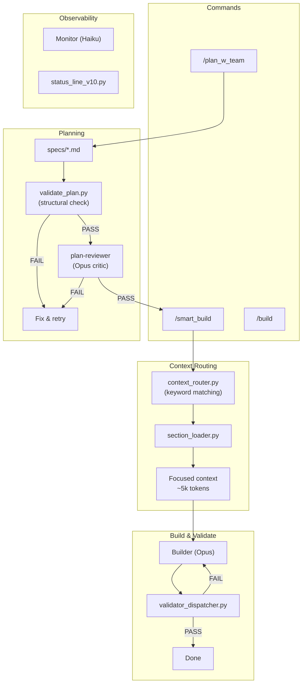
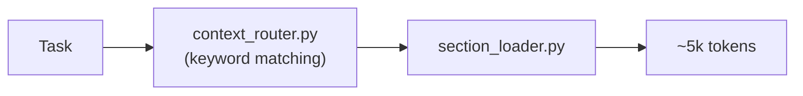

# Claude Code Hooks Mastery

> Personal fork of [disler/claude-code-hooks-mastery](https://github.com/disler/claude-code-hooks-mastery) — a multi-agent framework for **Java**, **React/TypeScript**, and **Python** projects built on Claude Code hooks.

## Quick Start

```bash
curl -fsSL https://raw.githubusercontent.com/a-simeshin/claude-code-hooks-mastery/main/install.sh | bash
```

Installs `.claude/` directory with refs, agents, hooks, and validators into the current project.

**Prerequisites:** [Claude Code](https://docs.anthropic.com/en/docs/claude-code), [Astral UV](https://docs.astral.sh/uv/) (auto-installed)

```bash
# Uninstall
curl -fsSL https://raw.githubusercontent.com/a-simeshin/claude-code-hooks-mastery/main/uninstall.sh | bash
```

## Architecture



## Agents

| Agent | Model | Role |
|-------|-------|------|
| **builder** | Opus | Writes code for Java/React/Python with Context7 docs integration |
| **validator** | Sonnet | Read-only verification — runs checks, reads files, never modifies |
| **plan-reviewer** | Opus | Critic agent — reviews plans against 8 criteria before execution |
| **monitor** | Haiku | Observes parallel sub-agents, reports status every 10 seconds |
| **context-router** | Haiku | Semantic task analysis (fallback for keyword router) |
| **meta-agent** | — | Generates new agent configuration files from descriptions |

## Context Routing

Instead of loading all reference files (~40k tokens), the router loads only matching sections (~5k tokens) — **85% savings**, zero LLM cost.



```bash
echo "Add FastAPI endpoint with 404 handling" | \
  uv run --script .claude/hooks/context_router.py | \
  uv run --script .claude/hooks/section_loader.py
# loads: python-patterns#core + python-patterns#fastapi
```

The builder also auto-detects stacks via project files:

```
pom.xml                       → java-patterns + java-testing
package.json + "next"         → react-patterns#core + #nextjs
package.json + "vite"         → react-patterns#core + #vite
pyproject.toml + "fastapi"    → python-patterns#core + #fastapi
```

**Why keyword matching over LLM?** Haiku was tested as a semantic router but scored 1/6 — hallucinated section names, generated code instead of JSON. Keyword matching: 8/8, zero cost, <100ms.

### Reference Files

| File | Sections | Content |
|------|----------|---------|
| `java-patterns.md` | `basics`, `java17`, `java21`, `errors`, `search` | Java 17/21, Spring Boot patterns |
| `java-testing.md` | `structure`, `integration`, `http`, `kafka`, `jdbc`, `mockito`, `e2e`, `maven` | Testcontainers, Podman, Allure, Selenide |
| `react-patterns.md` | `core`, `nextjs`, `vite` | React 19, Next.js 15 App Router, React Router v7 |
| `python-patterns.md` | `core`, `fastapi`, `testing` | Python 3.11+ typing, FastAPI + Pydantic v2, Pytest |

## Plan Review (Critic Pattern)

Before executing a plan, `/smart_build` runs a two-stage validation gate:

**Stage 1 — Structural** (`validate_plan.py`, deterministic):
- Required sections present (Task Description, Objective, Steps, Acceptance Criteria)
- Agent types reference existing `.claude/agents/team/*.md` files
- Task dependencies form a valid DAG (no cycles, no missing refs)

**Stage 2 — Content** (`plan-reviewer.md`, Opus):

| # | Criterion | What it catches |
|---|-----------|-----------------|
| 1 | Problem Alignment | Plan solves a different problem than stated |
| 2 | Completeness | Requirements with no corresponding tasks |
| 3 | Questions Gap | Critical unknowns assumed without justification |
| 4 | Risk Assessment | Dangerous operations without safeguards |
| 5 | Overengineering | 200-line framework for a 20-line problem |
| 6 | Pattern Compliance | Contradicts project patterns from `.claude/refs/` |
| 7 | Dependency Correctness | Tasks depend on things not yet built |
| 8 | Cost Appropriateness | Opus for trivial tasks, Haiku for complex reasoning |

One FAIL on any criterion = overall FAIL. Plan must be fixed before execution.

**Real-world example:** critic caught that a plan proposed creating 5 "new" hook files that already existed (up to 319 lines each). Verdict: FAIL on 4/8 criteria — prevented a 14-agent deployment that would have overwritten working code.

**Research:**
- [ACC-Collab (ICLR 2025)](https://openreview.net/forum?id=nfKfAzkiez) — Actor-Critic pattern outperforms unconstrained multi-agent debate
- [MAST (ICLR 2025)](https://arxiv.org/abs/2503.13657) — 53% of multi-agent failures stem from planning errors
- [AdaptOrch (2026)](https://arxiv.org/abs/2602.16873) — 12-23% improvement from optimal agent topology selection

## Validators

A single `validator_dispatcher.py` replaces 7+ separate PostToolUse hook entries. It reads the file extension from stdin and runs only matching validators:

| Extension | Validators |
|-----------|------------|
| `.java` | Spotless, Maven compile, PMD (+ JaCoCo for test files) |
| `.ts`, `.tsx` | ESLint, TypeScript compiler |
| `.js`, `.jsx` | ESLint, Prettier |
| `.py` | Ruff, Ty, Bandit |
| `pom.xml` | Maven compile, OSS Index |

## Status Line (v10)

Real-time visibility into parallel sub-agents in the terminal — updates every 300ms, no extra cost.

**Idle:**
```
[Opus] [######---------] | 42.0% used | ~116k left | abc12345
```

**Agents running:**
```
[Opus] [###-----] 42% | ▶2 ✓1
 ▶ builder         12s  Edit Service.java
 ▶ Explore         8s   Read App.tsx
```

How it works: reads `logs/subagent_start.json` + `logs/subagent_stop.json`, filters by session ID, extracts current tool action from transcript `.jsonl`. Uses `fcntl` file locking against race conditions from parallel agents.

## Commands

| Command | Description |
|---------|-------------|
| `/plan` | Create an implementation plan in `specs/` |
| `/plan_w_team` | Create a plan with multi-agent team orchestration |
| `/smart_build` | Build with context routing + plan review gate |
| `/build` | Direct build without routing |
| `/git_status` | Repository status overview |
| `/question` | Answer questions about the project without coding |

## Credits

- Original repository by [@disler](https://github.com/disler)
