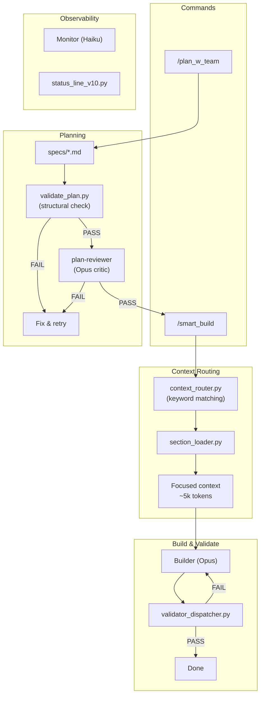

# Claude Code Hooks Mastery

> Personal fork of [disler/claude-code-hooks-mastery](https://github.com/disler/claude-code-hooks-mastery) — a multi-agent framework for **Java**, **React/TypeScript**, and **Python** projects built on Claude Code hooks.

## Quick Start

```bash
curl -fsSL https://raw.githubusercontent.com/a-simeshin/claude-code-hooks-mastery/main/install.sh | bash
```

Installs `.claude/` directory with refs, agents, hooks, and validators into the current project.

**Prerequisites:** [Claude Code](https://docs.anthropic.com/en/docs/claude-code), [Astral UV](https://docs.astral.sh/uv/) (auto-installed)

```bash
# Uninstall
curl -fsSL https://raw.githubusercontent.com/a-simeshin/claude-code-hooks-mastery/main/uninstall.sh | bash
```

## Architecture



## Features

| Feature | Summary | Docs |
|---------|---------|------|
| **Context Routing** | Keyword-based section routing — 85% token savings, zero LLM cost, <100ms | [docs/context-routing.md](docs/context-routing.md) |
| **Plan Review** | Two-stage validation gate — structural check + 8-criteria Opus critic | [docs/plan-review.md](docs/plan-review.md) |
| **Validators** | Smart dispatcher runs matching validators per file extension (Java/React/Python) | [docs/validators.md](docs/validators.md) |
| **Status Line** | Real-time sub-agent monitoring in terminal with 300ms refresh | [docs/status-line.md](docs/status-line.md) |

## Commands

| Command | Description |
|---------|-------------|
| `/plan_w_team` | Create a plan with multi-agent team orchestration |
| `/smart_build` | Build with context routing + plan review gate |
| `/build` | Direct build without routing |
| `/git_status` | Repository status overview |
| `/question` | Answer questions about the project without coding |

## Credits

- Original repository by [@disler](https://github.com/disler)
- Research: [ACC-Collab (ICLR 2025)](https://openreview.net/forum?id=nfKfAzkiez), [MAST (ICLR 2025)](https://arxiv.org/abs/2503.13657), [AdaptOrch (2026)](https://arxiv.org/abs/2602.16873)
