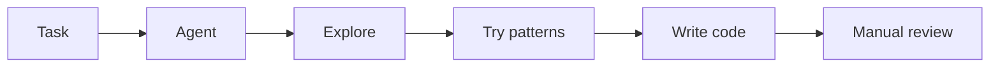

# Claude Code Hooks Mastery

> **Fork Notice:** This is a personal fork of [disler/claude-code-hooks-mastery](https://github.com/disler/claude-code-hooks-mastery) tailored for **Java** and **Java + React** projects.

## What's Different in This Fork

| Addition | Description |
|----------|-------------|
| **Java Validators** | Spotless (Palantir), Maven compile, JaCoCo 80%, PMD, OSS Index security |
| **React/TS Validators** | ESLint, TypeScript compiler, Prettier |
| **Python Validators** | Bandit security scanner |
| **Java Patterns** | `.claude/refs/java-patterns.md` — Java 17/21 coding standards, Spring Boot patterns |
| **Java Testing** | `.claude/refs/java-testing.md` — Testcontainers, Podman, Allure, Selenide E2E, JaCoCo |
| **Universal Builder** | Single agent for Java/React/Python with auto-detection and Context7 integration |
| **References on Demand** | Auto-load refs based on task keywords (test, controller, component, etc.) |

### Default Claude Code Flow



### This Fork — References on Demand


**Key Differences:**

| Aspect | Default | This Fork |
|--------|---------|-----------|
| **Context** | Reactive exploration | Proactive refs loading |
| **Standards** | Agent's training data | Your `.claude/refs/*.md` |
| **Validation** | Manual review | Auto-validators on Write/Edit |
| **Feedback** | After task complete | Immediate block + fix |

## Quick Start

```bash
# Run in your project directory
curl -fsSL https://raw.githubusercontent.com/a-simeshin/claude-code-hooks-mastery/main/install.sh | bash
```

This installs `.claude/` with refs, agents, and validators. Start Claude Code to use them.

### Uninstall

```bash
curl -fsSL https://raw.githubusercontent.com/a-simeshin/claude-code-hooks-mastery/main/uninstall.sh | bash
```

## Validators Auto-Trigger by File Extension

| Extension | Validators |
|-----------|------------|
| `.java` | spotless, maven_compile |
| `.ts`, `.tsx` | eslint, tsc |
| `.js`, `.jsx` | eslint, prettier |
| `.py` | ruff, ty, bandit |

## Prerequisites

- **[Astral UV](https://docs.astral.sh/uv/getting-started/installation/)** — Fast Python package installer
- **[Claude Code](https://docs.anthropic.com/en/docs/claude-code)** — Anthropic's CLI for Claude AI

## Original Documentation

- [Original repository](https://github.com/disler/claude-code-hooks-mastery) by [@disler](https://github.com/disler)
- [ORIGINAL_README.md](ORIGINAL_README.md) — full documentation on hooks, sub-agents, status lines, output styles
