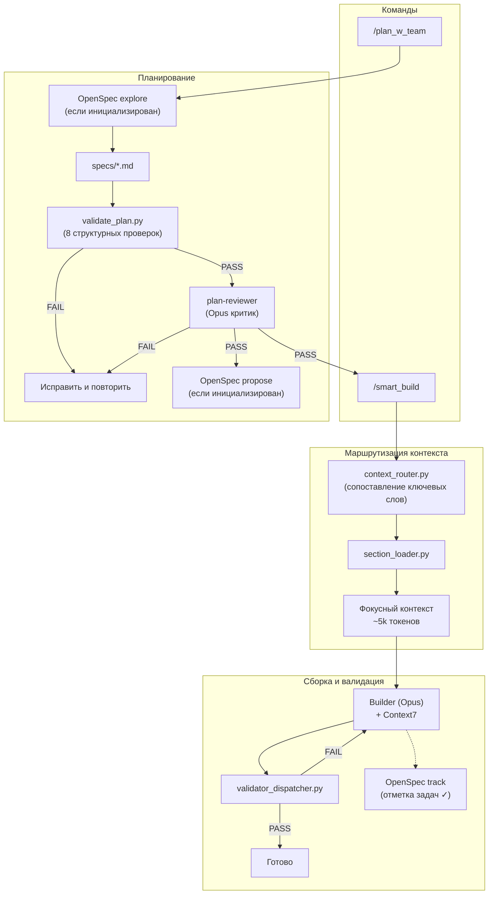

# Claude Code Hooks Mastery

[](https://github.com/a-simeshin/claude-code-hooks-mastery/blob/main/README.md)
[](https://github.com/a-simeshin/claude-code-hooks-mastery/blob/main/README.ru.md)

> Персональный форк [disler/claude-code-hooks-mastery](https://github.com/disler/claude-code-hooks-mastery) — мультиагентный фреймворк для проектов на **Java**, **React/TypeScript** и **Python**, построенный на хуках Claude Code.

## Цель

Сделать работу Claude Code в агентном режиме **максимально независимой и консистентной** — вы описываете задачу, Claude Code выдаёт качественный результат, соответствующий вашим ожиданиям.

### Принципы

1. **Автоматизация каждого действия** — если действие существует, оно автоматизировано через LLM (планирование, ревью, валидация, запись знаний)
2. **Контроль через детерминированные скрипты** — все действия управляются жёсткими скриптами, а не решениями LLM (валидаторы, роутеры, диспетчеры)
3. **Запрет на удаление файлов** — деструктивные операции запрещены; хуки обеспечивают это на системном уровне
4. **Документирование в память проекта** — решения и результаты записываются в долгосрочную память на уровне проекта (Serena, OpenSpec)
5. **Строгая валидация формата** — структура планов и документации проверяется структурными валидаторами до начала выполнения
6. **Стандарты кода по стеку** — конвенции написания кода и тестов подгружаются в агенты динамически скриптами в зависимости от обнаруженного технологического стека

## Быстрый старт

```bash
curl -fsSL https://raw.githubusercontent.com/a-simeshin/claude-code-hooks-mastery/main/install.sh | bash
```

Устанавливает директорию `.claude/` с refs, агентами, хуками и валидаторами в текущий проект.

**Зависимости:** [Claude Code](https://docs.anthropic.com/en/docs/claude-code), [Astral UV](https://docs.astral.sh/uv/) (ставится автоматически)

```bash
# Неинтерактивная установка (для CI/автоматизации Claude Code)
bash install.sh --force

# Пользовательские параметры через переменные окружения
STATUS_LINE_CHOICE=2 TTS_ENABLED=y bash install.sh --force

# Удаление
curl -fsSL https://raw.githubusercontent.com/a-simeshin/claude-code-hooks-mastery/main/uninstall.sh | bash
```

## Архитектура



> Пунктирные линии (- - ->) обозначают опциональные шаги OpenSpec — основной пайплайн работает без установленного OpenSpec.

## Возможности

Этот форк расширяет [оригинальный репозиторий](https://github.com/disler/claude-code-hooks-mastery) от [@disler](https://github.com/disler).

| Возможность | Что делает | vs Оригинал | Docs |
|-------------|-----------|-------------|------|
| **Context Routing** | Маршрутизация по ключевым словам — загружает только нужные refs для задачи, без затрат на LLM | Оригинал загружает все refs в контекст | [docs/context-routing.md](docs/context-routing.md) |
| **Plan With Team** | Двухраундовое интервью + каталог маршрутизации секций + стратегия тестирования + 8 проверок валидации | Нет структурной валидации в оригинале | [docs/plan-w-team.md](docs/plan-w-team.md) |
| **Testing Strategy** | Обязательная пирамида тестирования 80/15/5 (unit / integration-API / UI e2e), выделенная задача `write-tests` | Нет в оригинале | [docs/testing-strategy.md](docs/testing-strategy.md) |
| **Plan Review** | Двухэтапный гейт перед сборкой: структурный валидатор + 8-критериальный критик на Opus | Нет в оригинале | [docs/plan-review.md](docs/plan-review.md) |
| **Context7** | Опциональный поиск актуальной документации для любой библиотеки через MCP | Нет в оригинале | [docs/context7.md](docs/context7.md) |
| **Serena** | Опциональная семантическая навигация по коду через LSP — поиск символов, ссылок, иерархии типов | Нет в оригинале | [docs/serena.md](docs/serena.md) |
| **Validators** | Умный диспетчер запускает подходящие валидаторы по расширению файла (Java/React/Python) | Отдельные хуки на каждый инструмент в оригинале | [docs/validators.md](docs/validators.md) |
| **Status Line** | Прогресс-бар контекстного окна (3 варианта: usage bar, powerline, cost tracking) | Базовый в оригинале | [docs/status-line.md](docs/status-line.md) |
| **OpenSpec** | Опциональная интеграция с living specs — чтение существующих спецификаций, создание изменений после ревью плана, отслеживание прогресса задач во время сборки | Нет в оригинале | [docs/openspec.md](docs/openspec.md) |
| **Install / Uninstall** | Установка одной командой `curl` + неинтерактивный режим для CI/Claude Code | Ручная настройка в оригинале | [docs/install.md](docs/install.md) |

## MCP-интеграции

### [Context7](https://github.com/upstash/context7) (опционально)

Поиск актуальной документации для любой библиотеки. Когда доступен, агенты builder и validator запрашивают Context7 перед реализацией, чтобы получить актуальные API-ссылки вместо данных из обучения. Покрывает Spring Boot, React, FastAPI и любые другие библиотеки. Если не настроен — агенты используют refs и данные обучения.

### [Serena](https://github.com/oraios/serena) (опционально)

Семантическая навигация по коду через Language Server Protocol. Когда доступна, все агенты предпочитают символьную навигацию Serena (`find_symbol`, `get_symbols_overview`, `find_referencing_symbols`) вместо Glob/Grep. Plan_w_team также использует `write_memory` / `read_memory` для сохранения архитектурных решений между сессиями. Если Serena не настроена — агенты используют Glob/Grep/Read.

### [OpenSpec](https://www.npmjs.com/package/@fission-ai/openspec) (опционально)

Living specifications и дельта-трекинг. При установке (`npm i -g @fission-ai/openspec && openspec init --tools claude`) интегрируется в пайплайн в трёх точках:

- **Explore** (plan_w_team Step 2) — читает существующие спецификации через `openspec list/show` CLI для информирования вопросов интервью
- **Propose** (plan_w_team Step 13) — создаёт артефакты изменений (`openspec/changes/<name>/`) после прохождения ревью плана
- **Track** (smart_build Step 4) — отмечает выполненные задачи `[x]` в `tasks.md` инкрементально, видимо через `openspec view`

После сборки используйте `/opsx:verify` и `/opsx:archive` (собственные slash-команды OpenSpec) для валидации и финализации. Если OpenSpec не установлен — все шаги пропускаются молча.

## Команды

| Команда | Описание |
|---------|----------|
| `/plan_w_team` | Создать план с интервью, OpenSpec explore, гейтом ревью плана и OpenSpec propose |
| `/smart_build` | Сборка с маршрутизацией контекста + инкрементальное отслеживание задач OpenSpec |
| `/plan` | Быстрый одноагентный план реализации |
| `/update_status_line` | Обновить пользовательские key-value пары в статусной строке сессии |
| `/all_tools` | Показать все доступные инструменты |

## Credits

- Оригинальный репозиторий от [@disler](https://github.com/disler)
- Исследования: [ACC-Collab (ICLR 2025)](https://openreview.net/forum?id=nfKfAzkiez), [MAST (ICLR 2025)](https://arxiv.org/abs/2503.13657), [AdaptOrch (2026)](https://arxiv.org/abs/2602.16873)
