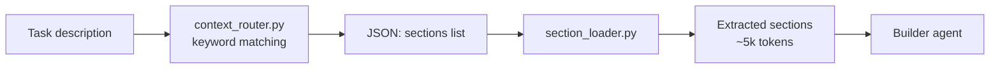

# Context Routing

## Problem

You ask Claude Code: *"Add GET /api/tutors/{id} endpoint with 404 handling and integration test"*.

Claude needs to know your project's coding standards — how you handle errors, how you structure tests, what patterns you follow. Without guidance, it writes code based on its training data: generic, inconsistent with your codebase.

You can write coding standards into `.claude/refs/` files — but then Claude loads **all of them** into context every time. For a Java + React + Python monorepo with 4 ref files, that's ~40,000 tokens of standards loaded even when you're only fixing a typo in one Python file.

This creates a tradeoff:
- **No standards** → Claude writes generic code that doesn't match your project
- **All standards loaded** → 40k tokens burned on every task, most of them irrelevant

## Solution

A deterministic keyword router that reads the task description and loads **only the sections that match**.

For the task above, it detects keywords `endpoint`, `404`, `test` and loads exactly 4 sections:
- `java-patterns#basics` — how you structure Spring controllers
- `java-patterns#errors` — how you handle 404 with @ControllerAdvice
- `java-testing#structure` — how you name tests and use AssertJ
- `java-testing#http` — how you write MockMvc integration tests

Result: **~5,800 tokens** instead of ~40,000. The builder gets exactly the context it needs — nothing more.

```
Task: "Add GET /api/tutors/{id} with 404 and integration test"

Without routing:  java-patterns.md (full)     → 4,200 tokens
                  java-testing.md (full)      → 8,600 tokens
                  react-patterns.md (full)    → 13,500 tokens  ← irrelevant
                  python-patterns.md (full)   → 12,400 tokens  ← irrelevant
                  Total:                        ~40,000 tokens

With routing:     java-patterns#basics        → 1,800 tokens
                  java-patterns#errors        → 1,200 tokens
                  java-testing#structure      → 1,400 tokens
                  java-testing#http           → 1,400 tokens
                  Total:                        ~5,800 tokens   (85% savings)
```

## How It Works



### Step 1: Routing

`context_router.py` — a Python script with a keyword-to-section mapping table. No LLM, no API calls.

```bash
echo "Add GET /api/tutors/{id} with 404 and test" | \
  uv run --script .claude/hooks/context_router.py
```

Output:
```json
{
  "sections": [
    "java-patterns#basics",
    "java-patterns#errors",
    "java-testing#structure",
    "java-testing#http"
  ],
  "reasoning": "Matched: endpoint, 404, test"
}
```

The router understands both English and Russian keywords. It disambiguates stacks — `endpoint` alone is ambiguous, but `pom.xml` in the project resolves it to Java.

### Step 2: Section Loading

`section_loader.py` reads the JSON, opens the matching `.claude/refs/*.md` files, and extracts only the marked sections:

```markdown
<!-- section:errors -->
## Error Handling

Use @ControllerAdvice with specific exception classes...
<!-- /section:errors -->
```

```bash
# Full pipeline: route → load
echo "Add GET /api/tutors/{id} with 404 and test" | \
  uv run --script .claude/hooks/context_router.py | \
  uv run --script .claude/hooks/section_loader.py
```

The builder receives focused, relevant context and writes code that matches your standards.

### Step 3: Framework Auto-Detection

The builder agent also detects project frameworks from config files and adjusts which sections to load:

```
pom.xml                       → java-patterns + java-testing
package.json + "next"         → react-patterns#core + #nextjs
package.json + "vite"         → react-patterns#core + #vite
package.json + "react" only   → react-patterns#core
pyproject.toml + "fastapi"    → python-patterns#core + #fastapi
pyproject.toml only           → python-patterns#core
```

## Reference Files

Each ref file is split into sections with `<!-- section:name -->` markers. Only requested sections are loaded.

| File | Sections | Content |
|------|----------|---------|
| `java-patterns.md` | `basics`, `java17`, `java21`, `errors`, `search` | Java 17/21, Spring Boot patterns |
| `java-testing.md` | `structure`, `integration`, `http`, `kafka`, `jdbc`, `mockito`, `e2e`, `maven` | Testcontainers, Podman, Allure, Selenide |
| `react-patterns.md` | `core`, `nextjs`, `vite` | React 19, Next.js 15 App Router, React Router v7 |
| `python-patterns.md` | `core`, `fastapi`, `testing` | Python 3.11+ typing, FastAPI + Pydantic v2, Pytest |

## Why Not LLM Routing?

The first version used a Haiku agent as a semantic router — read the task, decide which sections to load. It was tested on 6 tasks across all stacks.

**Result: 1 correct out of 6.**

Failures:
- Hallucinated section names that don't exist (`java-patterns#controllers`, `react#hooks`)
- Ignored the Python and React section catalogs entirely
- Returned code implementations instead of routing JSON
- Mixed up section names between different ref files

The Haiku agent was replaced with deterministic keyword matching. Same test: **8 out of 8 correct**, zero cost, <100ms per call.

| Approach | Correct | Cost per call | Latency |
|----------|---------|---------------|---------|
| Haiku LLM router | 1/6 (17%) | $0.0002 | ~800ms |
| Keyword matching | 8/8 (100%) | $0 | <100ms |

## Key Files

- `.claude/hooks/context_router.py` — keyword-based routing engine
- `.claude/hooks/section_loader.py` — section extractor (`<!-- section:name -->` markers)
- `.claude/refs/*.md` — reference files with marked sections
