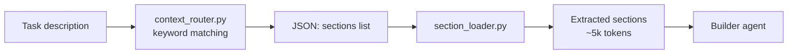

# Context Routing

## Problem

Claude Code agents have exactly one built-in way to consistently receive project knowledge — `CLAUDE.md`. This file is loaded into every session, every agent, every prompt. It works for small, single-stack projects.

But for a full-stack monorepo with Java + React + Python:

- Java coding standards alone are ~4,200 tokens (Spring Boot patterns, error handling, Java 17/21 features)
- Java testing patterns — another ~8,600 tokens (Testcontainers, MockMvc, Selenide, JaCoCo)
- React patterns — ~13,500 tokens (React 19, Next.js 15, Vite, React Router v7)
- Python patterns — ~12,400 tokens (FastAPI, Pydantic v2, Pytest)

Putting all of this into `CLAUDE.md` means **~40,000 tokens loaded on every single interaction** — even when you're fixing a typo in one Python file. That's expensive, and research shows it actively degrades quality (see [Research](#research) below).

This creates a tradeoff:
- **No standards** → Claude writes generic code that doesn't match your project
- **Standards in CLAUDE.md** → 40k tokens burned per interaction, most irrelevant, quality degrades from context overload

## Solution

A deterministic keyword router that reads the task description, detects which file types the agent will work with, and loads **only the matching standard sections**.

The key guarantee: **the right standards are always loaded for the right file type**. If the agent is editing `.java` files — it gets Java patterns. If it's working on `.tsx` — it gets React patterns. No manual selection, no guessing, no waste.

For the task *"Add GET /api/tutors/{id} endpoint with 404 handling and integration test"*, the router detects keywords `endpoint`, `404`, `test` and loads exactly 4 sections:
- `java-patterns#basics` — how you structure Spring controllers
- `java-patterns#errors` — how you handle 404 with @ControllerAdvice
- `java-testing#structure` — how you name tests and use AssertJ
- `java-testing#http` — how you write MockMvc integration tests

Result: **~5,800 tokens** instead of ~40,000. The builder gets exactly the context it needs — nothing more.

```
Task: "Add GET /api/tutors/{id} with 404 and integration test"

CLAUDE.md approach:  java-patterns.md (full)     → 4,200 tokens
                     java-testing.md (full)      → 8,600 tokens
                     react-patterns.md (full)    → 13,500 tokens  ← irrelevant
                     python-patterns.md (full)   → 12,400 tokens  ← irrelevant
                     Total:                        ~40,000 tokens

Context routing:     java-patterns#basics        → 1,800 tokens
                     java-patterns#errors        → 1,200 tokens
                     java-testing#structure      → 1,400 tokens
                     java-testing#http           → 1,400 tokens
                     Total:                        ~5,800 tokens   (85% savings)
```

## How It Works



### Step 1: Routing

`context_router.py` — a Python script with a keyword-to-section mapping table. No LLM, no API calls.

```bash
echo "Add GET /api/tutors/{id} with 404 and test" | \
  uv run --script .claude/hooks/context_router.py
```

Output:
```json
{
  "sections": [
    "java-patterns#basics",
    "java-patterns#errors",
    "java-testing#structure",
    "java-testing#http"
  ],
  "reasoning": "Matched: endpoint, 404, test"
}
```

The router understands both English and Russian keywords. It disambiguates stacks — `endpoint` alone is ambiguous, but `pom.xml` in the project resolves it to Java.

### Step 2: Section Loading

`section_loader.py` reads the JSON, opens the matching `.claude/refs/*.md` files, and extracts only the marked sections:

```markdown
<!-- section:errors -->
## Error Handling

Use @ControllerAdvice with specific exception classes...
<!-- /section:errors -->
```

```bash
# Full pipeline: route → load
echo "Add GET /api/tutors/{id} with 404 and test" | \
  uv run --script .claude/hooks/context_router.py | \
  uv run --script .claude/hooks/section_loader.py
```

The builder receives focused, relevant context and writes code that matches your standards.

### Step 3: Framework Auto-Detection

The builder agent detects project frameworks from config files and guarantees the correct standards are loaded for each file type:

```
pom.xml                       → java-patterns + java-testing
package.json + "next"         → react-patterns#core + #nextjs
package.json + "vite"         → react-patterns#core + #vite
package.json + "react" only   → react-patterns#core
pyproject.toml + "fastapi"    → python-patterns#core + #fastapi
pyproject.toml only           → python-patterns#core
```

This means in a monorepo with all three stacks, only the standards matching the current task's file types are loaded — never all at once.

## Planning Integration

Context routing works at build time — but the keywords have to come from somewhere. In a multi-agent team workflow, the planner (`/plan_w_team`) generates a `**Stack**` field for each task, and the validator (`validate_plan.py`) enforces that the keywords actually route to sections.

This creates a three-layer architecture:

```
/plan_w_team (Opus)              → picks keywords from Section Routing Catalog
  ↓
validate_plan.py Check 7         → rejects plan if keywords don't route
  ↓
context_router.py                → loads matching sections into builder
```

### The Problem: Generic Stack Keywords

The first version of `/plan_w_team` had a simple keyword list — just stack names like `Java`, `Spring Boot`, `JPA`. These keywords all mapped to a single section (`java-patterns#basics`), leaving the builder without error handling patterns, testing standards, or framework-specific guidance.

Real example from a favorites feature plan:

```
Task: "Implement FavoriteController with error handling"
Stack: "Java Spring Boot JPA controller Lombok Maven"
                                    ↓
Routed sections: java-patterns#basics (only 1 section)
Missing: java-patterns#errors ← no error handling patterns loaded
```

### The Fix: Section Routing Catalog

`/plan_w_team` now includes a full catalog of 18 sections with their trigger keywords. The LLM picks section-specific keywords based on what each task actually does:

```
Task: "Implement FavoriteController with error handling"
Stack: "Java Spring Boot controller exception error handling"
                                    ↓
Routed sections: java-patterns#basics + java-patterns#errors (2 sections)
```

The catalog is a table in `plan_w_team.md` that maps each section to its trigger keywords and when to use them. The LLM reads the table and composes the Stack field accordingly.

### Validation: Check 7

`validate_plan.py` Check 7 enforces that every task's Stack field routes to at least one section:

```python
def check_stack_field(tasks):
    route_fn = _load_router()
    for task in tasks:
        stack = task.get("stack", "")
        if not stack:
            errors.append(f"Task has no **Stack** field")
        elif route_fn:
            result = route_fn(stack)
            if not result.get("sections"):
                errors.append(f"Stack doesn't match any routing keywords")
```

This catches two failure modes:
- **Missing Stack** — task has no `**Stack**` field at all
- **Dead keywords** — Stack contains words that don't trigger any section

### Before/After Comparison

Tested on the same 7-task plan (favorites feature for a Java + React project):

| Task | Before (generic keywords) | After (catalog keywords) |
|------|--------------------------|-------------------------|
| create-foundation | `java-patterns#basics` | `java-patterns#basics` |
| backend-api | `java-patterns#basics` | `java-patterns#basics` + `#errors` |
| backend-tests | *(task didn't exist)* | `#basics` + `java-testing#structure` + `#http` + `#mockito` |
| frontend-context | `react-patterns#core` + `#vite` | `react-patterns#core` + `#vite` |
| frontend-page | `react-patterns#core` + `#vite` | `react-patterns#core` + `#vite` |

**Result: 3 → 7 unique sections loaded (2.3x more context)**. The builder now receives error handling patterns for API tasks and testing standards (Allure, MockMvc, Mockito) for test tasks.

## Reference Files

Each ref file is split into sections with `<!-- section:name -->` markers. Only requested sections are loaded.

| File | Sections | Content |
|------|----------|---------|
| `java-patterns.md` | `basics`, `java17`, `java21`, `errors`, `search` | Java 17/21, Spring Boot patterns |
| `java-testing.md` | `structure`, `integration`, `http`, `kafka`, `jdbc`, `mockito`, `e2e`, `maven` | Testcontainers, Podman, Allure, Selenide |
| `react-patterns.md` | `core`, `nextjs`, `vite` | React 19, Next.js 15 App Router, React Router v7 |
| `python-patterns.md` | `core`, `fastapi`, `testing` | Python 3.11+ typing, FastAPI + Pydantic v2, Pytest |

## Why Not LLM Routing?

The first version used a Haiku agent as a semantic router — read the task, decide which sections to load. It was tested on 6 tasks across all stacks.

**Result: 1 correct out of 6.**

Failures:
- Hallucinated section names that don't exist (`java-patterns#controllers`, `react#hooks`)
- Ignored the Python and React section catalogs entirely
- Returned code implementations instead of routing JSON
- Mixed up section names between different ref files

The Haiku agent was replaced with deterministic keyword matching. Same test: **8 out of 8 correct**, zero cost, <100ms per call.

| Approach | Correct | Cost per call | Latency |
|----------|---------|---------------|---------|
| Haiku LLM router | 1/6 (17%) | $0.0002 | ~800ms |
| Keyword matching | 8/8 (100%) | $0 | <100ms |

## Research

The approach is supported by recent research on context management for LLM agents:

### Context overload degrades quality

- **Context Rot** ([Chroma Research, 2025](https://research.trychroma.com/context-rot)) — LLM performance degrades as context length increases, even when the relevant information is present. Models have an "attention budget" — every added token depletes it. Accuracy drops from 75% to 55% when relevant content moves deeper into context.

- **Maximum Effective Context Window** ([Paulsen, 2025, arXiv:2509.21361](https://arxiv.org/abs/2509.21361)) — The effective context window is drastically smaller than advertised. Across 11 LLMs, the effective window ranged from 100–2,500 tokens for complex tasks. Our ~5k loaded tokens are near the practical upper bound.

- **SWE-Pruner** ([Yang et al., 2026, arXiv:2601.16746](https://arxiv.org/abs/2601.16746)) — Read-type operations consume 76.1% of total tokens in coding agents. Section-level granularity (our approach) preserves code structure better than token-level pruning, which breaks syntax. Achieves 23–38% token reductions with less than 1% performance drop.

### Routing strategies

- **Routing Survey** ([Varangot-Reille et al., 2025, arXiv:2502.00409](https://arxiv.org/abs/2502.00409)) — Comprehensive survey of routing strategies: similarity-based, supervised, RL-based, generative. Our keyword router is a deterministic similarity-based approach — the simplest and most reliable category. The survey suggests hybrid (keyword + embedding) as the next evolution.

- **RCR-Router** ([arXiv:2508.04903](https://arxiv.org/abs/2508.04903)) — Role-aware context routing for multi-agent systems. Routes different context subsets to agents based on their role (builder vs validator). Reduces token consumption while improving task success rates.

### How coding tools solve this

- **Sourcegraph Cody** ([Hartman et al., 2024, arXiv:2408.05344](https://arxiv.org/abs/2408.05344)) — Production coding assistant using hybrid dense-sparse retrieval. Combines keyword precision with semantic recall. Context quality is the single largest driver of recommendation quality.

- **Cursor Rules Study** ([Jiang et al., 2025, arXiv:2512.18925](https://arxiv.org/abs/2512.18925)) — Analysis of 401 repos with coding standards. 28.7% of rule lines are duplicates. Different languages and domains require different rule types — validating the need for per-stack routing rather than monolithic standards files.

- **Aider** ([aider.chat](https://aider.chat/docs/repomap.html)) — Builds a repository map using tree-sitter + PageRank. Ranks symbols by reference frequency and dynamically fits them into the token budget.

### Compression and optimization

- **LLMLingua-2** ([Jiang et al., Microsoft Research, 2024, arXiv:2403.12968](https://arxiv.org/abs/2403.12968)) — Up to 20x prompt compression with minimal performance loss. Could be applied as a post-routing step to compress loaded sections further.

- **AttentionRAG** ([Fang et al., 2025, arXiv:2503.10720](https://arxiv.org/abs/2503.10720)) — Uses the model's own attention patterns to prune context. Achieves 6.3x compression while maintaining performance. Could validate whether our keyword mappings align with what the model actually attends to.

- **Agentic RAG Survey** ([Singh et al., 2025, arXiv:2501.09136](https://arxiv.org/abs/2501.09136)) — Identifies four patterns for retrieval: reflection, planning, tool use, multi-agent collaboration. Suggests adding a reflection step where the agent can request additional sections if the initial routing was insufficient.

## Key Files

- `.claude/hooks/context_router.py` — keyword-based routing engine
- `.claude/hooks/section_loader.py` — section extractor (`<!-- section:name -->` markers)
- `.claude/hooks/validators/validate_plan.py` — plan validator with Check 7 (Stack field enforcement)
- `.claude/commands/plan_w_team.md` — planner with Section Routing Catalog
- `.claude/refs/*.md` — reference files with marked sections
