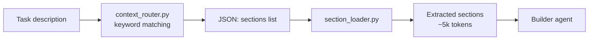

# Context Routing

## Problem

Claude Code agents have exactly one built-in way to consistently receive project knowledge — `CLAUDE.md`. This file is loaded into every session, every agent, every prompt. It works for small, single-stack projects.

But for a full-stack monorepo with Java + React + Python:

- Java coding standards alone are ~4,200 tokens (Spring Boot patterns, error handling, Java 17/21 features)
- Java testing patterns — another ~8,600 tokens (Testcontainers, MockMvc, Selenide, JaCoCo)
- React patterns — ~13,500 tokens (React 19, Next.js 15, Vite, React Router v7)
- Python patterns — ~12,400 tokens (FastAPI, Pydantic v2, Pytest)

Putting all of this into `CLAUDE.md` means **~40,000 tokens loaded on every single interaction** — even when you're fixing a typo in one Python file. That's expensive, and research shows it actively degrades quality (see [Research](#research) below).

This creates a tradeoff:
- **No standards** → Claude writes generic code that doesn't match your project
- **Standards in CLAUDE.md** → 40k tokens burned per interaction, most irrelevant, quality degrades from context overload

## Solution

A deterministic keyword router that reads the task description, detects which file types the agent will work with, and loads **only the matching standard sections**.

The key guarantee: **the right standards are always loaded for the right file type**. If the agent is editing `.java` files — it gets Java patterns. If it's working on `.tsx` — it gets React patterns. No manual selection, no guessing, no waste.

For the task *"Add GET /api/tutors/{id} endpoint with 404 handling and integration test"*, the router detects keywords `endpoint`, `404`, `test` and loads exactly 4 sections:
- `java-patterns#basics` — how you structure Spring controllers
- `java-patterns#errors` — how you handle 404 with @ControllerAdvice
- `java-testing#structure` — how you name tests and use AssertJ
- `java-testing#http` — how you write MockMvc integration tests

Result: **~5,800 tokens** instead of ~40,000. The builder gets exactly the context it needs — nothing more.

```
Task: "Add GET /api/tutors/{id} with 404 and integration test"

CLAUDE.md approach:  java-patterns.md (full)     → 4,200 tokens
                     java-testing.md (full)      → 8,600 tokens
                     react-patterns.md (full)    → 13,500 tokens  ← irrelevant
                     python-patterns.md (full)   → 12,400 tokens  ← irrelevant
                     Total:                        ~40,000 tokens

Context routing:     java-patterns#basics        → 1,800 tokens
                     java-patterns#errors        → 1,200 tokens
                     java-testing#structure      → 1,400 tokens
                     java-testing#http           → 1,400 tokens
                     Total:                        ~5,800 tokens   (85% savings)
```

## How It Works



### Step 1: Routing

`context_router.py` — a Python script with a keyword-to-section mapping table. No LLM, no API calls.

```bash
echo "Add GET /api/tutors/{id} with 404 and test" | \
  uv run --script .claude/hooks/context_router.py
```

Output:
```json
{
  "sections": [
    "java-patterns#basics",
    "java-patterns#errors",
    "java-testing#structure",
    "java-testing#http"
  ],
  "reasoning": "Matched: endpoint, 404, test"
}
```

The router understands both English and Russian keywords. It disambiguates stacks — `endpoint` alone is ambiguous, but `pom.xml` in the project resolves it to Java.

### Step 2: Section Loading

`section_loader.py` reads the JSON, opens the matching `.claude/refs/*.md` files, and extracts only the marked sections:

```markdown
<!-- section:errors -->
## Error Handling

Use @ControllerAdvice with specific exception classes...
<!-- /section:errors -->
```

```bash
# Full pipeline: route → load
echo "Add GET /api/tutors/{id} with 404 and test" | \
  uv run --script .claude/hooks/context_router.py | \
  uv run --script .claude/hooks/section_loader.py
```

The builder receives focused, relevant context and writes code that matches your standards.

### Step 3: Framework Auto-Detection

The builder agent detects project frameworks from config files and guarantees the correct standards are loaded for each file type:

```
pom.xml                       → java-patterns + java-testing
package.json + "next"         → react-patterns#core + #nextjs
package.json + "vite"         → react-patterns#core + #vite
package.json + "react" only   → react-patterns#core
pyproject.toml + "fastapi"    → python-patterns#core + #fastapi
pyproject.toml only           → python-patterns#core
```

This means in a monorepo with all three stacks, only the standards matching the current task's file types are loaded — never all at once.

## Planning Integration

In a multi-agent team workflow, the planner ([`/plan_w_team`](plan-w-team.md)) provides routing hints via a `**Stack**` field on each task. The validator enforces that keywords route to sections, and the builder receives the right standards at execution time. See [Plan With Team](plan-w-team.md) for details on the catalog, validation, and requirements interview.

## Reference Files

Each ref file is split into sections with `<!-- section:name -->` markers. Only requested sections are loaded.

| File | Sections | Content |
|------|----------|---------|
| `java-patterns.md` | `basics`, `java17`, `java21`, `errors`, `search` | Java 17/21, Spring Boot patterns |
| `java-testing.md` | `structure`, `integration`, `http`, `kafka`, `jdbc`, `mockito`, `e2e`, `maven` | Testcontainers, Podman, Allure, Selenide |
| `react-patterns.md` | `core`, `nextjs`, `vite` | React 19, Next.js 15 App Router, React Router v7 |
| `python-patterns.md` | `core`, `fastapi`, `testing` | Python 3.11+ typing, FastAPI + Pydantic v2, Pytest |

## Why Not LLM Routing?

The first version used a Haiku agent as a semantic router — read the task, decide which sections to load. It was tested on 6 tasks across all stacks.

**Result: 1 correct out of 6.**

Failures:
- Hallucinated section names that don't exist (`java-patterns#controllers`, `react#hooks`)
- Ignored the Python and React section catalogs entirely
- Returned code implementations instead of routing JSON
- Mixed up section names between different ref files

The Haiku agent was replaced with deterministic keyword matching. Same test: **8 out of 8 correct**, zero cost, <100ms per call.

| Approach | Correct | Cost per call | Latency |
|----------|---------|---------------|---------|
| Haiku LLM router | 1/6 (17%) | $0.0002 | ~800ms |
| Keyword matching | 8/8 (100%) | $0 | <100ms |

## Research

| Research | Direct relevance |
|----------|-----------------|
| [Context Rot](https://research.trychroma.com/context-rot) (Chroma, 2025) | Accuracy drops 75% → 55% as context grows. Justifies loading ~5k tokens instead of ~40k. |
| [Maximum Effective Context Window](https://arxiv.org/abs/2509.21361) (Paulsen, 2025) | Effective window across 11 LLMs: 100–2,500 tokens for complex tasks. Our ~5k loaded tokens are near the practical ceiling. |
| [SWE-Pruner](https://arxiv.org/abs/2601.16746) (Yang et al., 2026) | Section-level granularity preserves code structure; token-level pruning breaks syntax. 23–38% token reduction, <1% performance drop. |
| [Routing Survey](https://arxiv.org/abs/2502.00409) (Varangot-Reille et al., 2025) | Classifies deterministic keyword matching as the simplest and most reliable routing category. |
| [RCR-Router](https://arxiv.org/abs/2508.04903) (2025) | Role-aware context routing in multi-agent systems — builder and validator receive different context subsets. Matches our builder/validator split. |
| [Cursor Rules Study](https://arxiv.org/abs/2512.18925) (Jiang et al., 2025) | 401 repos analyzed: different languages need different rule types, 28.7% of monolithic rules are duplicates. Validates per-stack routing. |

## Key Files

- `.claude/hooks/context_router.py` — keyword-based routing engine
- `.claude/hooks/section_loader.py` — section extractor (`<!-- section:name -->` markers)
- `.claude/hooks/validators/validate_plan.py` — plan validator with Check 7 (Stack field enforcement)
- `.claude/refs/*.md` — reference files with marked sections
