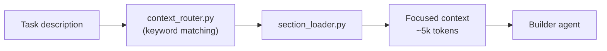

# Context Routing

Instead of loading all reference files (~40k tokens), the deterministic keyword router loads only matching sections (~5k tokens) — **85% savings**, zero LLM cost, <100ms.

## How It Works



1. `context_router.py` matches task keywords against a routing table (no LLM call)
2. Returns required section names as JSON: `{"sections": ["java-patterns#basics", "java-patterns#errors"]}`
3. `section_loader.py` extracts `<!-- section:name -->` marked sections from ref files
4. Builder gets focused context instead of entire files

## Usage

```bash
# Pipe task through router → loader
echo "Add FastAPI endpoint with 404 handling" | \
  uv run --script .claude/hooks/context_router.py | \
  uv run --script .claude/hooks/section_loader.py
# loads: python-patterns#core + python-patterns#fastapi (~7k tokens)
```

```bash
# Inspect routing decision only
echo "Add GET /api/tutors/{id} with integration test" | \
  uv run --script .claude/hooks/context_router.py
# {"sections": ["java-patterns#basics", "java-patterns#errors", "java-testing#structure", "java-testing#http"], "reasoning": "Matched: spring, 404, test"}
```

## Framework Auto-Detection

The builder agent auto-detects stacks via project files and loads relevant sections:

```
pom.xml                       → java-patterns + java-testing
package.json + "next"         → react-patterns#core + #nextjs
package.json + "vite"         → react-patterns#core + #vite
package.json + "react" only   → react-patterns#core
pyproject.toml + "fastapi"    → python-patterns#core + #fastapi
pyproject.toml only           → python-patterns#core
```

## Reference Files

| File | Sections | Content |
|------|----------|---------|
| `java-patterns.md` | `basics`, `java17`, `java21`, `errors`, `search` | Java 17/21, Spring Boot patterns |
| `java-testing.md` | `structure`, `integration`, `http`, `kafka`, `jdbc`, `mockito`, `e2e`, `maven` | Testcontainers, Podman, Allure, Selenide |
| `react-patterns.md` | `core`, `nextjs`, `vite` | React 19, Next.js 15 App Router, React Router v7 |
| `python-patterns.md` | `core`, `fastapi`, `testing` | Python 3.11+ typing, FastAPI + Pydantic v2, Pytest |

## Token Savings Example

**Task:** `"Add GET /api/tutors/{id} endpoint with 404 handling and integration test"`

| Approach | What's Loaded | Tokens |
|----------|---------------|--------|
| Full refs (all 4 files) | everything | ~40,000 |
| Keyword routing | basics + errors + structure + http | ~5,847 |
| **Savings** | | **85%** |

## Why Not LLM Routing?

Haiku was tested as a semantic router (context-router agent) but scored **1/6**:
- Hallucinated section names that don't exist
- Ignored Python/React section catalogs
- Generated code instead of returning JSON

Deterministic keyword matching: **8/8**, zero cost, <100ms.

## Key Files

- `.claude/hooks/context_router.py` — keyword-based routing engine
- `.claude/hooks/section_loader.py` — section extractor (`<!-- section:name -->` markers)
- `.claude/refs/*.md` — reference files with marked sections
