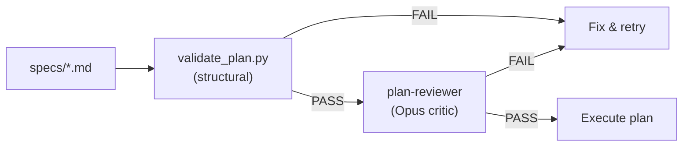

# Plan Review (Critic Pattern)

Before executing a plan, `/smart_build` runs a **two-stage validation gate** — structural checks + architect-level content review. This prevents wasted compute on flawed plans.

## How It Works



## Stage 1 — Structural Validation

`validate_plan.py` — deterministic, zero cost:

- Required sections present (Task Description, Objective, Steps, Acceptance Criteria)
- Agent types reference existing `.claude/agents/team/*.md` files
- Task dependencies form a valid DAG (no cycles, no missing refs)
- Team member roles match available agent types

## Stage 2 — Content Review

`plan-reviewer.md` — Opus critic agent evaluates the plan against **8 criteria**:

| # | Criterion | PASS | FAIL |
|---|-----------|------|------|
| 1 | **Problem Alignment** | Plan directly addresses the stated problem | Plan solves a different or tangential problem |
| 2 | **Completeness** | Every requirement maps to at least one task | Major requirements have no corresponding tasks |
| 3 | **Questions Gap** | No critical unknowns remain | Critical decisions assumed without justification |
| 4 | **Risk Assessment** | Risks identified and mitigated | Risky operations present without safeguards |
| 5 | **Overengineering** | Complexity matches problem scope | Unnecessarily complex for the problem |
| 6 | **Pattern Compliance** | Follows existing project patterns | Contradicts patterns without explanation |
| 7 | **Dependency Correctness** | Dependencies reflect actual build order | Tasks depend on things not yet built |
| 8 | **Cost Appropriateness** | Models match task complexity | Opus for trivial tasks or Haiku for complex reasoning |

**Verdict:** PASS / CONDITIONAL PASS / FAIL. One FAIL on any criterion = overall FAIL.

## Integration with `/smart_build`

```bash
/smart_build specs/my-plan.md
# Step 0: validate_plan.py → structural check
# Step 0: plan-reviewer agent → content review
# If both pass → execute plan
# If either fails → show issues, ask user to fix/continue/abort
```

## Real-World Example

When tested on `specs/hooks-update-with-team.md`, the critic detected:

- All 5 "new" hook files **already existed** (up to 319 lines each with `fcntl` file locking, TTS, regex patterns)
- All 5 status lines v5-v9 **already existed**, plus v10 the plan didn't know about
- `settings.json` **already configured** with all hooks
- The plan deployed **14 agents for zero-delta work**

**Verdict: FAIL** on 4/8 criteria (Problem Alignment, Questions Gap, Overengineering, Cost Appropriateness) — prevented a 14-agent deployment that would have either been a no-op or destructively overwritten working code.

## Research Basis

- [ACC-Collab (ICLR 2025)](https://openreview.net/forum?id=nfKfAzkiez) — Actor-Critic Constrained Collaboration outperforms unconstrained multi-agent debate. The builder (actor) proposes, the critic reviews with structured constraints.
- [MAST (ICLR 2025)](https://arxiv.org/abs/2503.13657) — Multi-Agent Software Testing failure taxonomy. 53.1% of multi-agent failures stem from planning errors — validating plans before execution addresses the largest failure category.
- [AdaptOrch (2026)](https://arxiv.org/abs/2602.16873) — Adaptive orchestration shows 12-23% improvement from optimal agent topology selection, validating the cost-appropriateness criterion.

## Key Files

- `.claude/hooks/validators/validate_plan.py` — structural plan validation
- `.claude/agents/team/plan-reviewer.md` — Opus critic agent definition
- `.claude/commands/smart_build.md` — integration point (Step 0)
