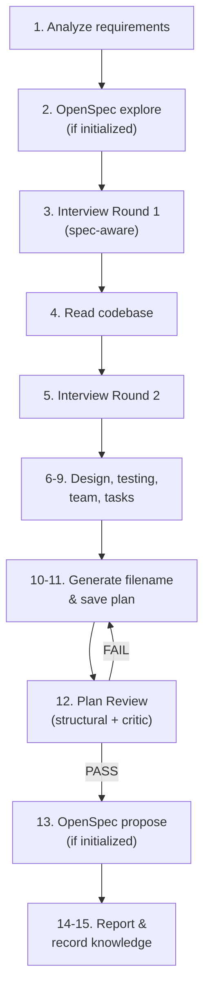

# Plan With Team

`/plan_w_team` generates implementation plans for multi-agent execution. It analyzes requirements, interviews the user, reads the codebase, and produces a spec document that `/smart_build` can execute with a team of builder agents.

## Workflow



## Two-Round Requirements Interview

The planner asks clarifying questions when it detects ambiguities — not about everything, but about every point where two or more valid interpretations exist or where the prompt is underspecified.

The two rounds are separated by codebase reading — this injects new information between rounds and keeps each round focused on what's knowable at that stage.

### Round 1: After Analyzing Requirements + OpenSpec Explore

Questions about ambiguities in the user's request — before reading any code. If OpenSpec findings exist from Step 2, they inform the questions. Ask when:

- **Contradiction detected** — the prompt implies two mutually exclusive approaches
- **Underspecified behavior** — key user states (unauthorized, empty data, error) are not described
- **Multiple valid approaches** — present both with pros/cons, let user choose
- **Design/UX choices** — placement, copy, interaction details that are matters of taste
- **Scope ambiguity** — unclear whether adjacent features are in or out of scope
- **Spec conflict** — OpenSpec findings reveal overlap or contradiction with existing living requirements

### Round 2: After Reading the Codebase

Questions about implementation choices visible from the code. Ask when:

- **Multiple patterns exist** — codebase has more than one way to solve this type of problem
- **Technical tradeoff with no clear winner** — both options valid, depends on unstated priorities
- **Integration ambiguity** — new feature fits in more than one place or way
- **Discovered edge case** — reading the code revealed a scenario the prompt didn't address

Skip a round entirely if every choice has a single obvious answer.

### Why Two Rounds, Not More

Research on multi-turn LLM interactions shows a consistent pattern: large gains in early interactions, diminishing returns by turns 3-5, and risk of degradation beyond that.

- **TiCoder** (Microsoft, ICSE 2024): m=1 gives +19pp, m=2 gives +7pp, m=3 gives +2pp. Plateau after 3 interactions.
- **LLMs Get Lost in Multi-Turn Conversation** (Microsoft, 2025): 39% average performance degradation in multi-turn vs single-turn across all models tested. Consolidating information into fewer, richer turns outperforms distributing across many.
- **Another Turn, Better Output?** (NeurIPS 2025): targeted feedback ("denormalized counter vs COUNT query?") sustains improvement; vague feedback ("anything else?") plateaus or reverses quality.
- **Information Gain per Turn** (NeurIPS 2025): information gain decays per turn without injection of new external data — which is why Round 2 works: reading the codebase between rounds injects new information.

Two rounds with new information between them is the sweet spot: enough to resolve ambiguities, short enough to avoid context degradation.

## Section Routing Catalog

Every task in a plan has a `**Stack**` field — keywords that tell the [context router](context-routing.md) which coding standards to load for the builder.

The planner picks keywords from a catalog embedded in its prompt:

| Section | Trigger keywords | Add when task involves |
|---------|-----------------|----------------------|
| **Java** | | |
| `java-patterns#basics` | `java`, `spring`, `controller`, `entity`, `jpa` | Any Java/Spring Boot code |
| `java-patterns#errors` | `exception`, `error handling`, `controlleradvice` | Exception handling, HTTP errors |
| `java-patterns#java17` | `record`, `pattern matching`, `switch expression` | Java 17 features |
| `java-patterns#java21` | `virtual thread`, `sequenced collection` | Java 21 features |
| **Java Testing** | | |
| `java-testing#structure` | `assertj`, `allure`, `test naming`, `test structure` | Test organization, Allure annotations |
| `java-testing#integration` | `testcontainers`, `integration test`, `podman` | Integration tests with containers |
| `java-testing#http` | `mockmvc`, `resttemplate`, `http test` | REST endpoint testing |
| `java-testing#kafka` | `kafka test`, `consumer test`, `producer test` | Kafka testing |
| `java-testing#jdbc` | `database test`, `repository test`, `jdbc test` | Database testing |
| `java-testing#mockito` | `mockito`, `spy` | Unit tests with mocking |
| `java-testing#e2e` | `selenide`, `e2e`, `page object` | E2E browser testing |
| `java-testing#maven` | `surefire`, `failsafe`, `jacoco` | Maven test plugins, coverage |
| **React** | | |
| `react-patterns#core` | `react`, `component`, `hook`, `useState`, `useEffect`, `tsx` | Any React code |
| `react-patterns#nextjs` | `next.js`, `server component`, `app router` | Next.js App Router |
| `react-patterns#vite` | `vite`, `react-router`, `code splitting` | Vite, React Router |
| **Python** | | |
| `python-patterns#core` | `python`, `typing`, `dataclass`, `asyncio` | Any Python code |
| `python-patterns#fastapi` | `fastapi`, `pydantic`, `apirouter`, `depends` | FastAPI endpoints |
| `python-patterns#testing` | `pytest`, `fixture`, `parametrize`, `conftest` | Python testing |

The Stack field combines stack keywords (selects the stack) with section keywords (selects specific sections):

```
Stack: "Java Spring Boot controller exception error handling"
         ↓ stack keywords            ↓ section keywords
     java-patterns#basics      java-patterns#errors
```

## Plan Review (Step 12)

After saving the plan, `/plan_w_team` runs a two-stage review gate before proceeding to OpenSpec propose. See [Plan Review](plan-review.md) for details on the 8 criteria.

## Stack Validation (Check 7)

The plan validator runs Check 7 on every task — imports `context_router.route()` and verifies the Stack field produces sections:

```python
result = route_fn(stack)
if not result.get("sections"):
    errors.append(f"Stack doesn't match any routing keywords")
```

Two failure modes caught:
- **Missing Stack** — task has no `**Stack**` field at all
- **Dead keywords** — Stack contains words that don't trigger any section

A plan with broken routing is rejected at validation, not discovered during build.

## Plan Format

The generated plan includes these sections:

| Section | Content |
|---------|---------|
| Task Description | What needs to be done |
| Objective | What "done" looks like |
| Problem Statement | Why this work is needed *(medium/complex tasks)* |
| Solution Approach | How the objective will be achieved *(medium/complex tasks)* |
| Relevant Files | Existing files to modify + new files to create |
| Implementation Phases | Foundation → Core → Integration *(medium/complex tasks)* |
| Team Orchestration | Team members with roles and agent types |
| Step by Step Tasks | Ordered tasks with IDs, dependencies, Stack, assignments |
| Acceptance Criteria | Measurable completion conditions |
| Validation Commands | Shell commands to verify the work |

## Research

| Research | Direct relevance |
|----------|-----------------|
| [ClarifyGPT](https://dl.acm.org/doi/10.1145/3660810) (FSE 2024) | Detect ambiguities → ask targeted questions → GPT-4 Pass@1 +9.84pp. Validates detect-then-ask approach. |
| [TiCoder](https://arxiv.org/abs/2404.10100) (ICSE 2024, Microsoft) | +19pp at m=1, +7pp at m=2, +2pp at m=3, plateau after 3. Validates diminishing returns curve. |
| [SpecFix](https://arxiv.org/abs/2505.07270) (ASE 2025) | Repairing ambiguous specs before generation: +30.9% Pass@1. Repairs transfer across models. |
| [LLMs Get Lost in Multi-Turn](https://arxiv.org/abs/2505.06120) (Microsoft, 2025) | 39% degradation in multi-turn. Consolidating into fewer richer turns > many thin turns. Validates two rounds, not five. |
| [Another Turn, Better Output?](https://arxiv.org/abs/2509.06770) (NeurIPS 2025) | Targeted feedback sustains gains; vague feedback plateaus or reverses. Validates specific questions over open-ended. |
| [Info Gain per Turn](https://openreview.net/pdf/2cb74ae648f650e37d77885eb6ef22c93d1860dc.pdf) (NeurIPS 2025) | IGT decays without new information injection. Validates codebase reading between Round 1 and Round 2. |

## Key Files

- `.claude/commands/plan_w_team.md` — planner prompt with 15-step workflow, catalog, and plan format
- `.claude/hooks/validators/validate_plan.py` — structural validator (8 checks including Stack)
- `.claude/agents/team/plan-reviewer.md` — Opus critic agent (Step 12)
- `.claude/hooks/context_router.py` — keyword router that Stack fields feed into
- `.claude/refs/*.md` — reference files with coding standards sections
