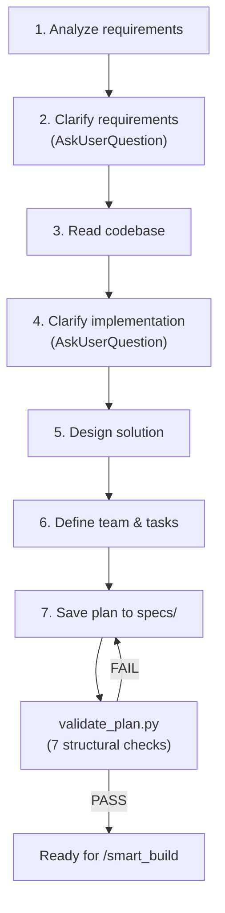

# Plan With Team

`/plan_w_team` generates implementation plans for multi-agent execution. It analyzes requirements, interviews the user, reads the codebase, and produces a spec document that `/smart_build` can execute with a team of builder agents.

## Workflow



## Two-Round Requirements Interview

Every assumption the planner makes instead of asking is a potential contradiction or missed requirement. The planner interviews the user aggressively — it is always cheaper to ask one extra question than to rewrite a plan or debug a wrong implementation.

### Round 1: After Analyzing Requirements

Questions about ambiguities in the user's request — before reading any code:

- **Error handling strategy** — "Return error code or silently succeed?"
- **Behavior per user state** — "What sees unauthorized user? Empty list user? Admin?"
- **Mutually exclusive approaches** — whenever two valid approaches exist, ask which one
- **Scope boundaries** — "Only this page or also admin panel?", "Include tests or separate task?"
- **Priority tradeoffs** — "Simplicity vs performance?", "Full feature or MVP first?"
- **UI/UX specifics** — "What text for empty state?", "Where exactly to place the button?"
- **Data model choices** — "Separate table or column on existing?", "Soft delete or hard delete?"

### Round 2: After Reading the Codebase

Questions about implementation choices visible from the code:

- **Pattern selection** — "Codebase has CartService (optimistic) and OrderService (pessimistic) — which to mirror?"
- **Technical tradeoffs** — "Denormalized counter vs COUNT query — codebase uses both, which fits here?"
- **Concurrency** — "JPA read-modify-write or atomic SQL?", "Optimistic or pessimistic locking?"
- **Integration** — "SecurityConfig has catch-all — add explicit rule for consistency?"
- **API contract** — "Return void or return updated entity?", "What HTTP status for each case?"
- **Edge cases from code** — "Existing code handles X this way — same pattern or different?"

The number of questions scales with complexity:
- **Complex features**: 5-15 questions across multiple `AskUserQuestion` calls per round
- **Medium tasks**: 3-5 questions per round
- **Trivial fixes**: 0 questions (skip both rounds)

## Section Routing Catalog

Every task in a plan has a `**Stack**` field — keywords that tell the [context router](context-routing.md) which coding standards to load for the builder.

The planner picks keywords from a catalog embedded in its prompt:

| Section | Trigger keywords | Add when task involves |
|---------|-----------------|----------------------|
| **Java** | | |
| `java-patterns#basics` | `java`, `spring`, `controller`, `entity`, `jpa` | Any Java/Spring Boot code |
| `java-patterns#errors` | `exception`, `error handling`, `controlleradvice` | Exception handling, HTTP errors |
| `java-patterns#java17` | `record`, `pattern matching`, `switch expression` | Java 17 features |
| `java-patterns#java21` | `virtual thread`, `sequenced collection` | Java 21 features |
| **Java Testing** | | |
| `java-testing#structure` | `assertj`, `allure`, `test naming`, `test structure` | Test organization, Allure annotations |
| `java-testing#integration` | `testcontainers`, `integration test`, `podman` | Integration tests with containers |
| `java-testing#http` | `mockmvc`, `resttemplate`, `http test` | REST endpoint testing |
| `java-testing#kafka` | `kafka test`, `consumer test`, `producer test` | Kafka testing |
| `java-testing#jdbc` | `database test`, `repository test`, `jdbc test` | Database testing |
| `java-testing#mockito` | `mockito`, `spy` | Unit tests with mocking |
| `java-testing#e2e` | `selenide`, `e2e`, `page object` | E2E browser testing |
| `java-testing#maven` | `surefire`, `failsafe`, `jacoco` | Maven test plugins, coverage |
| **React** | | |
| `react-patterns#core` | `react`, `component`, `hook`, `useState`, `useEffect`, `tsx` | Any React code |
| `react-patterns#nextjs` | `next.js`, `server component`, `app router` | Next.js App Router |
| `react-patterns#vite` | `vite`, `react-router`, `code splitting` | Vite, React Router |
| **Python** | | |
| `python-patterns#core` | `python`, `typing`, `dataclass`, `asyncio` | Any Python code |
| `python-patterns#fastapi` | `fastapi`, `pydantic`, `apirouter`, `depends` | FastAPI endpoints |
| `python-patterns#testing` | `pytest`, `fixture`, `parametrize`, `conftest` | Python testing |

The Stack field combines stack keywords (selects the stack) with section keywords (selects specific sections):

```
Stack: "Java Spring Boot controller exception error handling"
         ↓ stack keywords            ↓ section keywords
     java-patterns#basics      java-patterns#errors
```

## Stack Validation (Check 7)

The plan validator runs Check 7 on every task — imports `context_router.route()` and verifies the Stack field produces sections:

```python
result = route_fn(stack)
if not result.get("sections"):
    errors.append(f"Stack doesn't match any routing keywords")
```

Two failure modes caught:
- **Missing Stack** — task has no `**Stack**` field at all
- **Dead keywords** — Stack contains words that don't trigger any section

A plan with broken routing is rejected at validation, not discovered during build.

## Plan Format

The generated plan includes these sections:

| Section | Content |
|---------|---------|
| Task Description | What needs to be done |
| Objective | What "done" looks like |
| Problem Statement | Why this work is needed *(medium/complex tasks)* |
| Solution Approach | How the objective will be achieved *(medium/complex tasks)* |
| Relevant Files | Existing files to modify + new files to create |
| Implementation Phases | Foundation → Core → Integration *(medium/complex tasks)* |
| Team Orchestration | Team members with roles and agent types |
| Step by Step Tasks | Ordered tasks with IDs, dependencies, Stack, assignments |
| Acceptance Criteria | Measurable completion conditions |
| Validation Commands | Shell commands to verify the work |

## Research

| Research | Direct relevance |
|----------|-----------------|
| [ClarifyGPT](https://dl.acm.org/doi/10.1145/3660810) (FSE 2024) | Asking clarifying questions before code generation: GPT-4 Pass@1 +9.84pp. Validates two-round interview. |
| [TiCoder](https://arxiv.org/abs/2404.10100) (ICSE 2024, Microsoft) | Interactive intent clarification: +45.97pp Pass@1 within 5 interactions. |
| [SpecFix](https://arxiv.org/abs/2505.07270) (ASE 2025) | Repairing ambiguous specs before generation: +30.9% Pass@1. Transfers across models. |

## Key Files

- `.claude/commands/plan_w_team.md` — planner prompt with workflow, catalog, and plan format
- `.claude/hooks/validators/validate_plan.py` — structural validator (7 checks including Stack)
- `.claude/hooks/context_router.py` — keyword router that Stack fields feed into
- `.claude/refs/*.md` — reference files with coding standards sections
