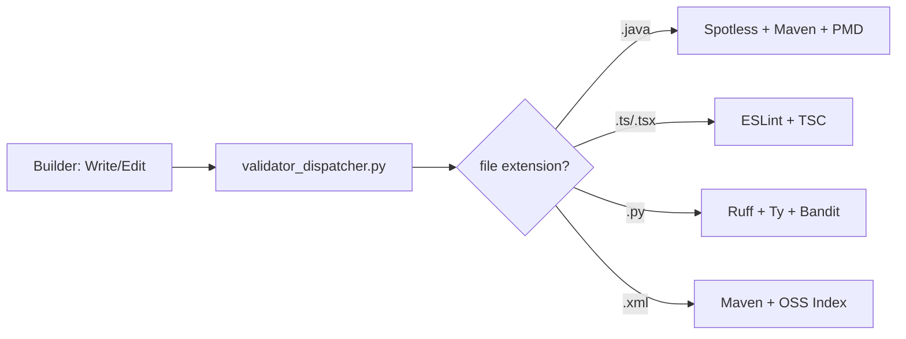

# Validators

Automated code quality checks that run as PostToolUse hooks — every time the builder writes or edits a file, matching validators execute automatically.

## Validator Dispatcher

A single `validator_dispatcher.py` replaces 7+ separate hook entries in `settings.json`. It reads the file extension from stdin JSON and runs only the validators relevant to that file type (~57% fewer subprocess invocations).

## Validators by Extension

| Extension | Validators | What they check |
|-----------|------------|-----------------|
| `.java` | Spotless, Maven compile, PMD | Code formatting (Palantir style), compilation, static analysis |
| `.java` (test) | + JaCoCo | Code coverage (80% threshold) |
| `.ts`, `.tsx` | ESLint, TypeScript compiler | Lint rules, type safety |
| `.js`, `.jsx` | ESLint, Prettier | Lint rules, formatting |
| `.mjs`, `.cjs` | ESLint | Lint rules |
| `.css`, `.scss`, `.json` | Prettier | Formatting |
| `.py` | Ruff, Ty, Bandit | Lint + format, type checking, security analysis |
| `pom.xml` | Maven compile, OSS Index | Build verification, dependency vulnerability scan |

## How It Works

1. Builder agent writes/edits a file
2. PostToolUse hook fires with JSON: `{"tool_name": "Write", "tool_input": {"file_path": "src/Main.java", ...}}`
3. `validator_dispatcher.py` extracts file extension from `file_path`
4. Runs matching validators sequentially
5. If any validator fails → builder sees the error and fixes it
6. If all pass → proceed to next step

## Key Files

- `.claude/hooks/validators/validator_dispatcher.py` — smart dispatcher
- `.claude/hooks/validators/spotless_validator.py` — Java formatting (Palantir)
- `.claude/hooks/validators/maven_compile_validator.py` — Java compilation
- `.claude/hooks/validators/pmd_validator.py` — Java static analysis
- `.claude/hooks/validators/jacoco_validator.py` — Java code coverage
- `.claude/hooks/validators/eslint_validator.py` — JS/TS linting
- `.claude/hooks/validators/tsc_validator.py` — TypeScript type checking
- `.claude/hooks/validators/prettier_validator.py` — JS/CSS formatting
- `.claude/hooks/validators/ruff_validator.py` — Python lint + format
- `.claude/hooks/validators/ty_validator.py` — Python type checking
- `.claude/hooks/validators/bandit_validator.py` — Python security analysis
- `.claude/hooks/validators/ossindex_validator.py` — Dependency vulnerabilities
